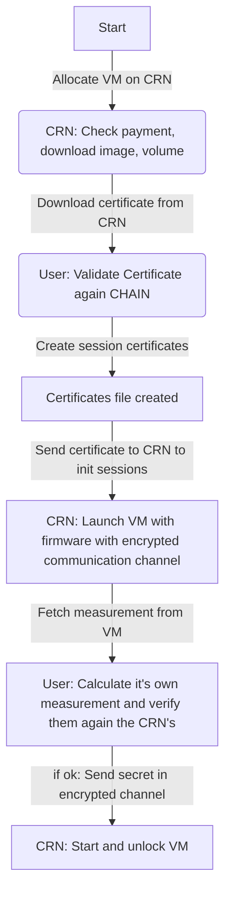
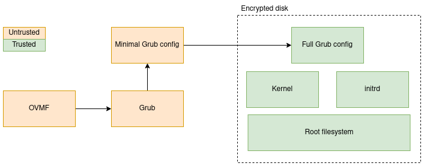
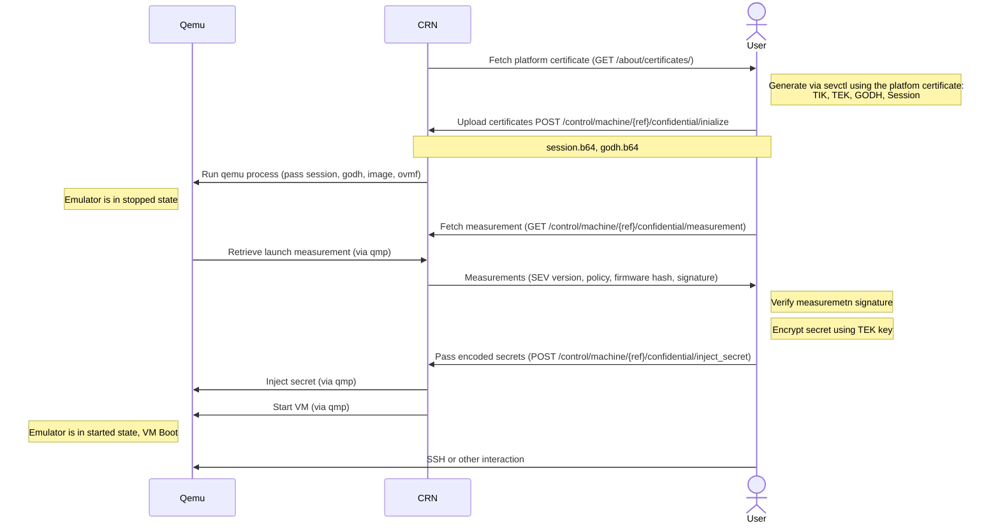

# Confidential computing

Aleph-vm offers to launch confidential VM with AMD SEV. This is also know as TEE, Trusted Execution Environment.

This is only supported for instances with the Qemu as the hypervisor.

## Life cycle
First, a user creates a VM message and sends it with notify_allocate. This notifies the orchestrator about the creation of the new VM.  
The user fetches the platform certificate, validates it's chain again AMD root certificate.
The user must then upload so-called Guest Owner certificates (created with sevctl) to create an encrypted channel between the user and the Security Processor.

Once  uploaded, the VM is started in Qemu in stopped mode: Qemu will allocate the RAM for the VM, load the firmware inside it and then let the AMD Security Processor encrypt the memory. Once this is done, the SEV endpoints allow to retrieve a measure of the memory of the VM and to decide whether to inject a user secret in the VM. Upon secret injection, the VM is launched, i.e. the VM CPU is started and goes through the boot sequence of the VM.

The end result is a virtual machine that is accessible through SSH and is completely encrypted in RAM, making it inaccessible from the point of view of the hypervisor.


    

# CRN Side

## Hardware requirement
4th Generation AMD EPYC™ Processors with SEV support.

This includes the [9004 Series Processors and 8004 Series Processors](https://www.amd.com/en/products/processors/server/epyc/4th-generation-9004-and-8004-series.html#tabs-4380fde236-item-2130f0d757-tab).

Note that the [4004 Series Processors do not provide SEV](https://www.amd.com/en/products/processors/server/epyc/infinity-guard.html) and are therefore not supported.

> ℹ️ The 4th Generation requirement stems from security vulnerabilities discovered in SEV on Zen3 and earlier architectures.

## Requirements for the CRN
* Support must be enabled in the computer BIOS
* The kernel and platform must support SEV.
* [sevctl](https://github.com/virtee/sevctl) must be installed. A copy is included in the aleph-vm Debian package and installed as `/opt/sevctl`.
* QEMU must be installed.

Check with the `sevctl ok` command that the system is supporting AMD SEV properly, you need at least:

```[ PASS ]   - Secure Encrypted Virtualization (SEV)```


See AMD DOC for more info on enabling SEV for your system
https://www.amd.com/fr/developer/sev.html


## Enabling the confidential computing feature in aleph-vm

Enable SEV in the configuration of `aleph-vm`, by default in `/etc/aleph-vm/supervisor.env`:
```
ALEPH_VM_ENABLE_QEMU_SUPPORT=1
ALEPH_VM_ENABLE_CONFIDENTIAL_COMPUTING=1

```

After launching the server you can check the endpoint
http://localhost:4020/status/config and verify that ENABLE_CONFIDENTIAL_COMPUTING is true


# User side
The user wanting to launch the VM, refered as the Guest Owner.

The aleph-sdk-python and the aleph-client provide way to launch , validate and start the VM.

## Create an encrypted VM image

The user must create a virtual machine disk image that has been encrypted using a password of their choice.
Follow the instruction here: https://github.com/aleph-im/aleph-vm/blob/dev-confidential/examples/example_confidential_image/README.md

## OVMF Launcher Firmware
Aleph.im provide a customized OMVF, a UEFI firmware for virtual machines, destined to work with the confidential image created above,
which can receive the Decryption key in a secure manner and pass it to the VM bootloaded (see Boot process section).

You will need the hash from the Firmware to know if it's the one launched the CRN.

Normally you can just create an encrypted VM image but you might also provide your own customised firmware in the `firmare`  field  of `trusted_execution`.    

See [the instructions on how the Firmware is built](runtimes/ovmf/README.md)


# Implementation details
## Aleph-message
on Instance type message, we check if the `content.environment.trusted_execution` is set  

```
    "trusted_execution": {
        "policy": 1,
        "firmware": "e258d248fda94c63753607f7c4494ee0fcbe92f1a76bfdac795c9d84101eb317"
    }
```

* Firmware is an [IPFS CID](https://docs.ipfs.tech/concepts/content-addressing/) reference to the OVMF firmware side (see OVMF firmware section)
* policy is an AMD SEV Policy (for now we only expose if AMD SEV and SEV-ES are supported)


## Boot process
The following diagram describes the different pieces of the VM boot process.



* OVMF: UEFI firmware (see section above), finds the bootloader and launches it
* Grub, the bootloader, decrypts the VM image and jumps to it.
* Grub configuration files: the unencrypted script looks for the user disk decryption password injected during
  the SEV boot process, then jumps to a complete Grub configuration file provided by the user inside the VM
  image.
* Kernel + initrd + root filesystem: The OS of the VM.

OVMF and Grub must be unencrypted. This means that the VM supervisor can alter these pieces at will.
It is therefore crucial that these pieces are part of the launch measurement retrieved during the SEV
sequence.

The  process documented in `runtimes/ovmf/README.md` can be used to generate a firmware image that combines OVMF and Grub
into one binary.


## Detailed sequence with endpoints 


# Development and debugging

See QEMU.md in general for QEMU related developement

 ## Note on systemd in dev
 If you use a local copy  of aleph-vm, for example a version you are developping on, by default  systemd will still use the system version  of  the  aleph controller. It is necessary to modify 
 `/etc/systemd/system/aleph-vm-controller@.service` to point  to your version.
 
 For example here is what I use
 ```
 [Unit]
Description=Aleph VM %i Controller Olivier
After=network.target

[Service]
Type=simple
RestartSec=5s
PrivateTmp=yes
NoNewPrivileges=true
WorkingDirectory=/home/olivier/pycharm-aleph-vm/src
Environment=PYTHONPATH=/home/olivier/pycharm-aleph-vm/src:$PYTHONPATH
ExecStart=/home/olivier/.virtualenvs/aleph-vm/bin/python3 -m aleph.vm.controllers --config=/var/lib/aleph/vm/%i-controller.json
Restart=no

[Install]
WantedBy=multi-user.target
```

After modification use the following command to have the modification taken into account
```shell
sudo systemctl daemon-reload
```

# Testing

After initializing the VM you can check it's status with:
`sudo systemctl status aleph-vm-controller@decadecadecadecadecadecadecadecadecadecadecadecadecadecadecadeca.service`

and see the logs with
` sudo journalctl -u aleph-vm-controller@decadecadecadecadecadecadecadecadecadecadecadecadecadecadecadeca.service`

**Important**
 
If you modify your base image between tests, you will need to delete the image file on disk (which is a delta of the base image)
For example using :
`sudo rm /var/lib/aleph/vm/volumes/persistent/decadecadecadecadecadecadecadecadecadecadecadecadecadecadecadeca/rootfs.qcow2`

Ensure the VM controller is stopped before!
`sudo systemctl stop aleph-vm-controller@decadecadecadecadecadecadecadecadecadecadecadecadecadecadecadeca.service`

 Between your test you can also stop the execution using
 ```http
 ### Stop all VMs
POST http://localhost:4020/control/allocations
Content-Type: application/json
X-Auth-Signature: test
Accept: application/json


{
  "persistent_vms": [],
  "instances": [
  ]
}

```

## Sevctl
Most operations done by `sevctl` are implemented in [aleph-sdk-python](https://github.com/aleph-im/aleph-sdk-python), either by calling it, calling the relevant endpoint
or by reimplementing the functionality in python. Here is a primer in case you need to call it manually.

### Install `sevctl`
If you are not taking the version from the debian package, you can install sevctl manually with cargo

Requirements:
 * `cargo`

On Ubuntu/ Debian install it via `apt install cargo` (as root)

To build and install sevctl
```cargo install  sevctl```

Ensure $HOME/.cargo/bin is in your PATH to launch it manually.

To configure which bin aleph-vm use, set the environment variable
```
ALEPH_VM_SEV_CTL_PATH=/home/olivier/.cargo/bin/sevctl
```

Alternatively, `sevctl` can be build from `git` : ```cargo install  --git  https://github.com/virtee/sevctl```


## Example Commands
## Generate session key
You can generate the sessions keys using sevctl
1. Export the platform key
 `sudo sevctl export  platform.pem`
2. Create the sessions files
   `sevctl session platform.pem 0x1 dwdw`
   
This will create the files `vm_godh.b64`,  `vm_session.b64`,  `vm_tek.bin`,  `vm_tik.bin` in your current directory 

### Calculate measurement

```shell
RUST_LOG=trace sevctl measurement build
  --api-major 01 --api-minor 55 --build-id 24 --policy 1
  --tik ~/pycharm-aleph-sdk-python/decadecadecadecadecadecadecadecadecadecadecadecadecadecadecadeca_tik.bin
  --firmware /usr/share/ovmf/OVMF.fd
  --nonce URQNqJAqh/2ep4drjx/XvA
  ```

### Debug
To enable debubbing log,  set the enviroment variable 
```env
RUST_LOG=trace
```