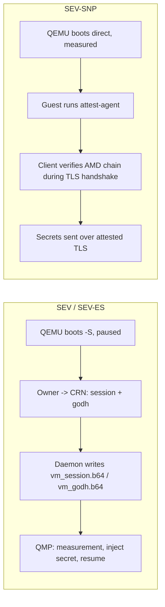

# Confidential computing

> Verified against: b2b31381 (2026-08-14)

## What this covers

Confidential VMs run under AMD SEV, SEV-ES or SEV-SNP. The three share a
QEMU host but diverge sharply in trust topology: SEV/SEV-ES use a
session-based, CRN-mediated launch-secret handshake, while SEV-SNP boots
measured and unattended, with secrets delivered later over a client-to-guest
attested TLS channel that never involves the CRN. This doc covers host
capability probing, the QEMU argv differences between the three paths, the
attestation stack (`aleph-tee`, the in-guest `aleph-attest-agent`; the
verifying client lives in the aleph-rs SDK), the measured Nix guest image and its
dm-verity boot chain, and what aleph-vm does with a V-PROGRAM message once
one arrives (runtime bundle staging, scheduler threading, NUMA/hugepage
placement). Create-path state machine detail (`await_session`, adoption,
teardown) lives in [`vm-lifecycle.md`](vm-lifecycle.md); the per-VM DHCP
server SNP guests need lives in [`networking.md`](networking.md). The
V-PROGRAM message schema itself (`VerifiableProgramContent` and its
`runtime`/`verification`/`workload`/`resources` fields) is defined in
aleph-message, a separate repository; this doc describes only what aleph-vm
does with that content after the agent receives it.

## The model

### Three launch paths, two trust topologies

**SEV / SEV-ES** is the older, session-based path
(`rust/crates/supervisor-controller/src/qemu.rs`, `build_confidential_argv`).
QEMU boots paused (`-S`) with an `-object sev-guest,...,dh-cert-file=...,
session-file=...` carrying the owner's Guest Owner Diffie-Hellman cert and
session blob. The daemon writes those two files
(`InitializeConfidential` -> `initialize_confidential` in
`rust/crates/supervisor-daemon/src/confidential.rs`) and starts the
controller unit; `GetMeasurement` and `InjectSecret` are QMP passthrough to
the paused QEMU (`query_sev_info`, `query_launch_measure`, `inject_secret` +
`continue_execution`), so they only ever answer against real SEV hardware.
SEV vs SEV-ES is not a separate launch path: it is the same argv builder,
distinguished by the policy's `SEV_ES_POLICY_BIT` (`0x4`). This entire flow
is CRN-mediated: the owner exchanges session material with the CRN, which
relays it into the guest before the vCPU ever runs.

**SEV-SNP** (`build_snp_argv`) is a *measured direct-kernel boot*: no `-S`,
no session/godh files, `kernel-hashes=on` so OVMF hash-verifies the exact
kernel, initrd and cmdline bytes before executing them. Because nothing is
paused for a secret handshake, there is no `SNP_LAUNCH_FINISH`-then-resume
race window to defend. Guest secrets instead cross an attested TLS channel
established directly between the client and the in-guest
`aleph-attest-agent`, after the VM is already running. This makes the CRN
structurally absent from the SNP trust path: the host is the adversary in
this model, so nothing the CRN mediates can be part of the proof. The two
paths cannot be merged: SEV/SEV-ES is CRN-mediated over HTTP/QMP, SNP is
direct client-to-guest, and forcing them through one flow would either break
existing SEV clients or reintroduce a CRN trust dependency into SNP.

Both paths read `cbitpos` / `reduced_phys_bits` from host CPUID leaf
`0x8000001F` at launch time (`rust/crates/supervisor-controller/src/cpuid.rs`,
`SevHostInfo::read`). These are memory-encryption parameters, not
measurement inputs: reading them from the live host keeps the supervisor
architecture-agnostic without perturbing the SNP launch digest, which pins
the fixed `-cpu EPYC-v4` instead.

Cold migration (`src/aleph/vm/agent/migration/`) refuses every confidential
mode across the board, gated independently at each end of the transfer. The
export endpoint (`src/aleph/vm/agent/views/migration.py`) rejects a running
VM with `info.confidential_mode is not ConfidentialMode.NONE` before
starting an export job, and the import runner
(`src/aleph/vm/agent/migration/runner.py`) separately rejects an incoming
instance message whose `environment.trusted_execution is not None`. Neither
gate depends on the other: a regression that drops one still leaves the
other refusing the transfer, for both the SEV/SEV-ES and SEV-SNP families
alike.

### Host capability probing

Two independent probes feed what a node advertises. `check_amd_sev_supported`
/ `_es_` / `_snp_` (`src/aleph/vm/utils/__init__.py`) check the
`kvm_amd` module parameters plus `/dev/sev` existing, and land in
`MachineProperties.cpu.features`. Separately,
`src/aleph/vm/agent/vcpu_probe.py` spawns a throwaway KVM-accelerated QEMU
and asks it `query-cpu-definitions`, keeping only EPYC-family models with no
unavailable features. This is the *only* source for the SNP guest vCPU
models a node advertises: a static CPUID table would drift from what this
exact QEMU build, host kernel and silicon combination can actually launch.
A failed or empty probe advertises nothing (`get_supported_snp_vcpu_types`
returns `[]`) rather than guessing. The result lands in
`TeeProperties.sev_snp.supported_vcpu_types`, a sibling of `properties.cpu`
in `MachineProperties` (`src/aleph/vm/agent/resources.py`,
`_get_tee_properties`), not nested under it: host-CPU facts and TEE-launch
facts are different axes, and keeping them siblings leaves room for a future
`tdx` or GPU-CC platform key without a schema break.

### The attestation stack

Three crates, cleanly separated by role.

**`rust/crates/aleph-tee`** is the shared library. `TeeBackend`
(`traits.rs`) deliberately covers only report retrieval and parsing, not
launch (host-CPUID inputs a report producer doesn't have) or verification
(a caller-supplied verdict is worthless from a possibly-compromised guest).
`SevSnpBackend` (`sev_snp/backend.rs`) opens `/dev/sev-guest` and issues the
`GET_REPORT` ioctl. `AttestationReport` (`types.rs`) carries *only* the raw
AMD-signed 1184-byte blob; there are no standalone `report_data` or
`measurement` copies, because the aleph-cvm donor carried unsigned JSON
copies alongside the signed blob and a verifier that trusted them could be
handed a genuine report for one key labeled with another. Every consumer
re-derives `report_data`/`measurement` by re-parsing the signed blob
(`sev_snp/report.rs`, `extract_report_data`/`extract_measurement`).
`report_data.rs` defines the two canonical, domain-separated `report_data`
schemes: `key_bound_report_data` (`SHA-384(DOMAIN_KEY || pubkey)`) proves
key possession, `fresh_report_data`
(`SHA-384(DOMAIN_FRESH || pubkey || nonce)`) proves liveness bound to the
same key. The domain tags stop the two namespaces from ever colliding, and
the raw nonce never lands in `report_data` verbatim. `x509.rs` defines the
private OID `1.3.6.1.4.1.60000.1.1` used to embed a DER-encoded
`AttestationReport` as a custom X.509 extension.

**`rust/crates/aleph-attest-agent`** is the in-guest sidecar
(`main.rs`). On boot it generates an ephemeral ECDSA P-384 key, requests a
key-bound report over it, embeds the report as the custom extension in a
self-signed cert (`tls.rs`, `generate_attested_tls_identity`), and serves
HTTPS on port 8443 via actix-web with `rustls`'s `ring` provider. Three
routes: `GET /.well-known/attestation?nonce=<hex>` returns a fresh report
bound to both the served key and the caller's nonce (`proxy.rs`,
`attestation_endpoint`); `POST /confidential/inject-secret` is a one-shot
secret store (`secrets.rs`) guarded by a single mutex around the whole
check-and-write (no TOCTOU window), writing files `O_CREAT|O_EXCL|O_NOFOLLOW`
mode 0600 into an owner-checked, mode-0700 directory, rejecting a second
call with 409; everything else falls through to a reverse proxy
(`proxy_handler`) that strips hop-by-hop headers and `Content-Length` before
forwarding to the upstream workload on `127.0.0.1:8080`.

**The verifying client** is not in this repository: it is the `attest`
module of the aleph-rs SDK (`crates/aleph-sdk/src/attest/`, driven by the
`aleph` CLI's `confidential` and `instance` commands). Its `SnpCertVerifier`
implements rustls's `ServerCertVerifier` trait so the *entire* verification
(attestation extension present, blob-derived key binding, measurement pin,
guest-policy pin, TCB floor, full AMD chain VCEK -> ASK -> ARK with a pinned
ARK) runs inside `verify_server_cert`, before the TLS handshake can
complete: a failed verification means no request byte ever leaves the
client. The `aleph-attest-cli` crate that used to live here was the
aleph-cvm donor's client and was removed once the SDK verifier superseded it.

### Measured Nix guest images and dm-verity

The `nix/` flake (`flake.nix`, `ovmf.nix`, `kernel.nix`, `initrd.nix`,
`rootfs.nix`, `workload.nix`) builds the OVMF firmware, kernel, initrd and a
dm-verity-protected ext4 rootfs deterministically: fixed `mkfs.ext4` UUID
and hash seed, `SOURCE_DATE_EPOCH=0`, no journal, non-lazy inode/journal
init. Determinism is not cosmetic here: the launch measurement
(`sev-snp-measure`, vendored and patched in `flake.nix`,
`measurementFor`) is a pure function of the exact bytes of OVMF, kernel,
initrd and cmdline, so a non-reproducible build makes precomputed
measurements meaningless. The attest-agent is built from its own cargo
workspace (`rust/crates/aleph-attest-agent`, own `Cargo.lock`) and the
initrd holds file content only (no nix store closure), so the launch
measurement moves only when the guest's files change; see divergences
entry 64(d) and `nix/initrd.nix`.

`nix/init.sh` is the guest's PID 1. It brings up networking (static `ip=`
if present on the cmdline, otherwise `udhcpc`), parses `roothash=` and
`workload_roothash=` out of `/proc/cmdline`, and for each present token
loads the dm-verity kernel modules and runs `veritysetup open` against the
matching device pair: `/dev/vda`+`/dev/vdb` for the platform rootfs and its
hash tree, `/dev/vdc`+`/dev/vdd` for an optional V-PROGRAM workload volume
and its hash tree. A verity failure on either pair powers the VM off rather
than falling through to an unverified mount. Whichever volume actually owns
`/sbin/init` (the workload if present, the platform rootfs otherwise) is
chrooted into after `prepare_chroot` bind-mounts `/proc`, `/sys`, `/dev`,
the agent's `/tmp/secrets` directory and a DNS resolv.conf into it. Before
that init runs, `setup_firewall` loads a stateless nftables ruleset that
drops everything inbound except loopback and `tcp dport 8443`, so the raw
workload port is never reachable except through the attest-agent's proxy.
The agent itself (`aleph-attest-agent --port 8443 --upstream
http://127.0.0.1:8080`) starts last.

The daemon-side half of the roothash story is
`rust/crates/supervisor-daemon/src/lifecycle.rs`, `snp_config_slice`. The
wire proto has no cmdline field (frozen), so the measured cmdline is
*derived*: the daemon reads a `{rootfs}.roothash` sidecar file next to the
rootfs disk and splices it into
`console=ttyS0 root=/dev/mapper/verity-root ro roothash={roothash}`; if a
`{rootfs}.workload_roothash` sidecar also exists (written by the agent-side
`build_vprogram_spec` in `src/aleph/vm/agent/vprogram_launch.py` from the
V-PROGRAM message's `workload.roothash`) it appends
` workload_roothash={hash}`. Both roothashes go verbatim into `-append`, so
both are validated as bare hex strings before being used; a
missing or malformed sidecar fails the spec closed (`InvalidBackend`)
rather than booting a VM whose cmdline the publisher never measured.

### V-PROGRAM: from message to running VM

`src/aleph/vm/vprogram/manifest.py` defines `RuntimeManifest`, the typed
model of the JSON published as a STORE message and pinned by a V-PROGRAM's
`runtime.ref`. It is strict (`extra="forbid"`) and closes the cmdline
template to a fixed placeholder set
(`platform_roothash`, `workload_roothash`, `verified_volumes`), so a
manifest cannot smuggle extra kernel parameters into a measured boot.
`bundle.py` packages the Nix image output into one deterministic tar.gz
(sorted entries, zeroed ownership, pinned mtimes) plus a `BundleInfo`
sidecar recording its sha256, size and per-role member paths, and builds
the manifest from those recorded facts.

`src/aleph/vm/agent/vprogram_launch.py` is the agent-side launch path:
fetch the manifest, fetch the bundle tarball and check its size and sha256
against the manifest before extracting anything, extract with tarfile's
`filter="data"` safety filter, resolve each declared member path and
confirm it stays inside the staging directory, then build a `CreateVmSpec`
with `TeeBackend.SEV_SNP`. Disk order is part of the contract: rootfs first
(`/dev/vda`), the platform dm-verity hash tree is force-inserted by the
daemon as the first SNP host volume (`/dev/vdb`), then an optional
workload data disk and its hash tree (`/dev/vdc`, `/dev/vdd`). Every
integrity check in this path fails closed as `VmSetupError`.

Once a V-PROGRAM is scheduled, `allocation.v_programs` is a third
allocation set alongside `persistent_vms` and `instances`, threaded through
`update_allocations` (`src/aleph/vm/agent/views/__init__.py`) the same way:
`start_persistent_vm` for each entry present, and, as the interesting
asymmetry, an unconditional stop for any running, persistent VM record with
`record.is_vprogram` that is *not* in the current allocation, checked ahead
of the general exemption that otherwise protects owner-paid confidential
VMs from being stopped. For a V-PROGRAM the scheduler is the sole source of
truth: since attestation is deployment-independent, the client re-verifies
the same measurement wherever the scheduler places it next.

### NUMA and hugepages as launch concerns

`rust/crates/supervisor-daemon/src/numa.rs` implements a pack-first
allocator: it tries node 0 first, then node 1, and so on, tracking per-node
vCPU and (separately) hugepage-page pools. Placement is enforced with a
systemd `AllowedCPUs=` drop-in written under the VM's controller unit
(`.service.d`), not a QEMU argv change, so CPU pinning ships independently
of the argv work. `hugepages.rs` reserves 2 MiB hugepages per node at
daemon boot from sysfs, fail-safe per node (a write failure on one node
does not abort reservation on the others). When a placement selects a
hugepage size, the QEMU argv builders
(`rust/crates/supervisor-controller/src/qemu.rs`,
`aleph_tee::sev_snp::qemu::sev_snp_qemu_args`) append
`hugetlb=on,hugetlbsize={1G|2M}` and `host-nodes={node},policy=bind` onto
the confidential or SNP memory-backend object; an unplaced VM's argv stays
byte-identical to the pre-NUMA baseline.

## Key invariants

- Cold migration refuses every confidential mode at two independent gates,
  source and destination, so a regression on one side does not open the
  path: `src/aleph/vm/agent/views/migration.py` (export,
  `confidential_mode is not ConfidentialMode.NONE`) and
  `src/aleph/vm/agent/migration/runner.py` (import,
  `environment.trusted_execution is not None`).
- An `AttestationReport` carries only the raw AMD-signed blob; every
  consumer derives `report_data`/`measurement` by re-parsing that blob,
  never from an unsigned copy that might travel alongside it:
  `rust/crates/aleph-tee/src/types.rs`,
  `rust/crates/aleph-tee/src/sev_snp/verify.rs` (and the SDK verifier on
  the client side).
- `report_data` schemes are domain-separated and, for the fresh scheme,
  bound to the served TLS public key; the raw nonce never lands in
  `report_data` verbatim: `rust/crates/aleph-tee/src/report_data.rs`.
- Reports produced above VMPL 1 are rejected before any network work
  (`MAX_ACCEPTED_VMPL`): `rust/crates/aleph-tee/src/sev_snp/verify.rs`.
- The AMD certificate chain's ARK is pinned to a crate-builtin AMD root,
  never trusted from whatever the KDS or a poisoned cache returns:
  `rust/crates/aleph-tee/src/sev_snp/verify.rs`.
- The TLS handshake only completes for a fully AMD-chain-verified TEE:
  the SDK's `verify_server_cert` runs the complete check before returning
  `Ok`, so no request or response byte can cross an unverified connection
  (aleph-rs, `crates/aleph-sdk/src/attest/ratls.rs`).
- The SEV-SNP guest policy is canonicalized to a bare `0x`-hex literal
  before it reaches the `sev-snp-guest` QEMU object, closing an argv
  property-injection path; an unparseable policy falls back to the
  restrictive `DEFAULT_POLICY = 0x30000` (debug disabled) rather than
  launching attacker-shaped text: `rust/crates/aleph-tee/src/sev_snp/qemu.rs`,
  `canonical_policy`.
- In-guest secret injection is one-shot and mutex-guarded end to end
  (check-and-write is atomic), and writes are `O_CREAT|O_EXCL|O_NOFOLLOW`
  into an owner-checked, mode-0700 directory:
  `rust/crates/aleph-attest-agent/src/secrets.rs`.
- The measured cmdline's platform and workload roothashes are validated as
  bare hex before being spliced verbatim into `-append`; a missing or
  malformed sidecar fails the spec closed rather than booting a
  mismeasured VM: `rust/crates/supervisor-daemon/src/lifecycle.rs`,
  `snp_config_slice`.
- An SEV-SNP measured cmdline never carries `ip=`; the guest always DHCPs,
  which is why SNP VMs need the per-tap DHCP server described in
  [`networking.md`](networking.md).
- GPU passthrough into an SEV-SNP guest fails closed at spec-build time
  (`InvalidBackend`); the SNP argv builder emits no passthrough devices at
  all, so nothing is silently dropped:
  `rust/crates/supervisor-daemon/src/lifecycle.rs`,
  `rust/crates/supervisor-controller/src/qemu.rs`.
- A hugepage size is never selected for a VM the allocator did not also
  place on a NUMA node (`debug_assert!` in `memory_backend_suffix`):
  `rust/crates/supervisor-controller/src/qemu.rs`.
- NUMA reconcile after a daemon restart maps an adopted VM's cpuset back to
  the node whose CPU set it exactly matches, and treats no-match as
  unpinned; it never assumes node 0:
  `rust/crates/supervisor-daemon/src/numa.rs`.
- SNP guest vCPU capability is advertised only from a live
  `query-cpu-definitions` probe of the host's own QEMU, filtered to EPYC
  models with no unavailable features; a failed or unsupported probe
  advertises nothing: `src/aleph/vm/agent/vcpu_probe.py`.
- TEE capability is a sibling field of `properties.cpu`, not nested inside
  it: `src/aleph/vm/agent/resources.py`.
- A V-PROGRAM absent from the current allocation is stopped even though it
  is confidential; the stop-guard checks `record.is_vprogram` before the
  general confidential exemption: `src/aleph/vm/agent/views/__init__.py`.
- Runtime bundle integrity is checked before any bytes are trusted: size
  and sha256 against the manifest before extraction, `filter="data"`
  during extraction, and every declared member path re-validated to stay
  inside the staging directory: `src/aleph/vm/agent/vprogram_launch.py`.

## Pointers into code

- Attestation library: `rust/crates/aleph-tee/src/traits.rs`,
  `rust/crates/aleph-tee/src/types.rs`,
  `rust/crates/aleph-tee/src/report_data.rs`,
  `rust/crates/aleph-tee/src/x509.rs`,
  `rust/crates/aleph-tee/src/sev_snp/`.
- In-guest agent: `rust/crates/aleph-attest-agent/src/main.rs`,
  `rust/crates/aleph-attest-agent/src/attestation.rs`,
  `rust/crates/aleph-attest-agent/src/tls.rs`,
  `rust/crates/aleph-attest-agent/src/secrets.rs`,
  `rust/crates/aleph-attest-agent/src/proxy.rs`.
- Verifying client: aleph-rs, `crates/aleph-sdk/src/attest/`.
- QEMU argv and host CPUID: `rust/crates/supervisor-controller/src/qemu.rs`,
  `rust/crates/supervisor-controller/src/cpuid.rs`.
- Migration refusal gates: `src/aleph/vm/agent/views/migration.py`,
  `src/aleph/vm/agent/migration/runner.py`.
- Daemon-side confidential mutations and SNP spec build:
  `rust/crates/supervisor-daemon/src/confidential.rs`,
  `rust/crates/supervisor-daemon/src/lifecycle.rs` (`snp_config_slice`),
  `rust/crates/supervisor-daemon/src/qmp.rs`.
- NUMA and hugepages: `rust/crates/supervisor-daemon/src/numa.rs`,
  `rust/crates/supervisor-daemon/src/hugepages.rs`.
- Wire surface: `proto/supervisor.proto` (`TeeBackend`, `TeeConfig`,
  `ConfidentialMode`, `Measurement`); full RPC/error conventions in
  [`wire-contract.md`](wire-contract.md).
- Measured Nix image: `nix/flake.nix`, `nix/ovmf.nix`, `nix/kernel.nix`,
  `nix/initrd.nix`, `nix/rootfs.nix`, `nix/workload.nix`, `nix/init.sh`.
- V-PROGRAM handling: `src/aleph/vm/vprogram/manifest.py`,
  `src/aleph/vm/vprogram/bundle.py`, `src/aleph/vm/agent/vprogram_launch.py`,
  `scripts/vprogram_bundle.py`.
- Capability probing and advertising: `src/aleph/vm/utils/__init__.py`
  (`check_amd_sev_supported` and friends), `src/aleph/vm/agent/vcpu_probe.py`,
  `src/aleph/vm/agent/resources.py`.
- Scheduler threading and the V-PROGRAM stop-guard:
  `src/aleph/vm/agent/views/__init__.py` (`update_allocations`).
