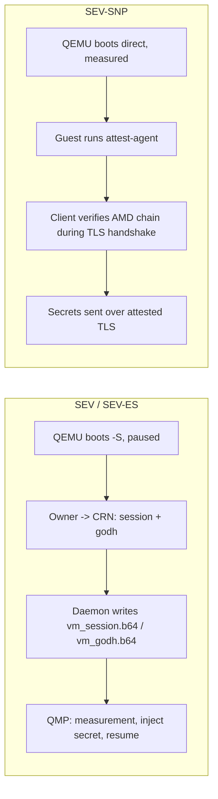

# Confidential computing

> Verified against: 973b8fd7 (2026-09-10)

## What this covers

Confidential VMs run under AMD SEV, SEV-ES or SEV-SNP. The three share a
QEMU host but diverge sharply in trust topology: SEV/SEV-ES use a
session-based, CRN-mediated launch-secret handshake, while SEV-SNP boots
measured and unattended, with secrets delivered later over a client-to-guest
attested TLS channel that never involves the CRN. This doc covers host
capability probing, the QEMU argv differences between the three paths, the
attestation stack (`aleph-tee`, the in-guest `aleph-attest-agent`; the
verifying client lives in the aleph-rs SDK), the measured Nix guest image and its
dm-verity boot chain, and what aleph-vm does with a V-PROGRAM message once
one arrives (runtime bundle staging, scheduler threading, NUMA/hugepage
placement). Create-path state machine detail (`await_session`, adoption,
teardown) lives in [`vm-lifecycle.md`](vm-lifecycle.md); the per-VM DHCP
server SNP guests need lives in [`networking.md`](networking.md). The
V-PROGRAM message schema itself (`VerifiableProgramContent` and its
`runtime`/`verification`/`workload`/`resources` fields) is defined in
aleph-message, a separate repository; this doc describes only what aleph-vm
does with that content after the agent receives it.

## The model

### Three launch paths, two trust topologies

**SEV / SEV-ES** is the older, session-based path
(`rust/crates/supervisor-controller/src/qemu.rs`, `build_confidential_argv`).
QEMU boots paused (`-S`) with an `-object sev-guest,...,dh-cert-file=...,
session-file=...` carrying the owner's Guest Owner Diffie-Hellman cert and
session blob. The daemon writes those two files
(`InitializeConfidential` -> `initialize_confidential` in
`rust/crates/supervisor-daemon/src/confidential.rs`) and starts the
controller unit; `GetMeasurement` and `InjectSecret` are QMP passthrough to
the paused QEMU (`query_sev_info`, `query_launch_measure`, `inject_secret` +
`continue_execution`), so they only ever answer against real SEV hardware.
SEV vs SEV-ES is not a separate launch path: it is the same argv builder,
distinguished by the policy's `SEV_ES_POLICY_BIT` (`0x4`). This entire flow
is CRN-mediated: the owner exchanges session material with the CRN, which
relays it into the guest before the vCPU ever runs.

**SEV-SNP** (`build_snp_argv`) is a *measured direct-kernel boot*: no `-S`,
no session/godh files, `kernel-hashes=on` so OVMF hash-verifies the exact
kernel, initrd and cmdline bytes before executing them. Because nothing is
paused for a secret handshake, there is no `SNP_LAUNCH_FINISH`-then-resume
race window to defend. Guest secrets instead cross an attested TLS channel
established directly between the client and the in-guest
`aleph-attest-agent`, after the VM is already running. This makes the CRN
structurally absent from the SNP trust path: the host is the adversary in
this model, so nothing the CRN mediates can be part of the proof. The two
paths cannot be merged: SEV/SEV-ES is CRN-mediated over HTTP/QMP, SNP is
direct client-to-guest, and forcing them through one flow would either break
existing SEV clients or reintroduce a CRN trust dependency into SNP.

Both paths read `cbitpos` / `reduced_phys_bits` from host CPUID leaf
`0x8000001F` at launch time (`rust/crates/supervisor-controller/src/cpuid.rs`,
`SevHostInfo::read`). These are memory-encryption parameters, not
measurement inputs: reading them from the live host keeps the supervisor
architecture-agnostic without perturbing the SNP launch digest, which pins
the fixed `-cpu EPYC-v4` instead.

Cold migration (`src/aleph/vm/agent/migration/`) refuses every confidential
mode across the board, gated independently at each end of the transfer. The
export endpoint (`src/aleph/vm/agent/views/migration.py`) rejects a running
VM with `info.confidential_mode is not ConfidentialMode.NONE` before
starting an export job, and the import runner
(`src/aleph/vm/agent/migration/runner.py`) separately rejects an incoming
instance message whose `environment.trusted_execution is not None`. Neither
gate depends on the other: a regression that drops one still leaves the
other refusing the transfer, for both the SEV/SEV-ES and SEV-SNP families
alike.

### Host capability probing

Three independent probes feed what a node advertises. `check_amd_sev_supported`
/ `_es_` / `_snp_` (`src/aleph/vm/utils/__init__.py`) check the
`kvm_amd` module parameters plus `/dev/sev` existing, and land in
`MachineProperties.cpu.features`. Separately,
`src/aleph/vm/agent/vcpu_probe.py` spawns a throwaway KVM-accelerated QEMU
and asks it `query-cpu-definitions`, keeping only EPYC-family models with no
unavailable features. This is the *only* source for the SNP guest vCPU
models a node advertises: a static CPUID table would drift from what this
exact QEMU build, host kernel and silicon combination can actually launch.
A failed or empty probe advertises nothing (`get_supported_snp_vcpu_types`
returns `[]`) rather than guessing. The result lands in
`TeeProperties.sev_snp.supported_vcpu_types`, a sibling of `properties.cpu`
in `MachineProperties` (`src/aleph/vm/agent/resources.py`,
`_tee_properties`), not nested under it: host-CPU facts and TEE-launch
facts are different axes, and keeping them siblings leaves room for a future
`tdx` platform key without a schema break. The third probe is daemon-side:
`probe_cc_mode` (`rust/crates/supervisor-daemon/src/gpu_cc.rs`) reads a
GPU's confidential-computing mode out of a BAR0 register and reports it per
card in `HostInfo.available_gpus[*].cc_mode`; the agent turns cards probed
`on` into the `nvidia_cc` capability block (`nvidia_cc_properties` in
`resources.py`), advertised only alongside `sev_snp` since a confidential
GPU on a host that cannot launch a confidential guest is not usable.

### Host requirements for SEV-SNP

SEV-SNP guest launches need QEMU >= 9.1, the first release with the
`sev-snp-guest` QOM object the probe checks for. Of the packaged targets,
Debian 13 (QEMU 9.x) and Ubuntu 26.04 (QEMU 10.2) ship one; Ubuntu 24.04
(QEMU 8.2) and Debian 12 (QEMU 7.2) can serve plain SEV/SEV-ES but not SNP,
whatever `query-cpu-definitions` reports. `kvm_amd nested=0` is fine, a legitimate hardening posture: the
filter ignores nested-virt-only unavailable features since 2.0.1, so it no
longer empties the advertisement. The probe retries every 60s after an empty
result, so a live QEMU upgrade heals the advertisement without an agent
restart. Check either end: `/about/capability`'s `tee_unavailable_reason`,
or the agent's startup log line (`log_snp_launch_capability`,
`src/aleph/vm/agent/supervisor.py`).

### The attestation stack

Three crates, cleanly separated by role.

**`rust/crates/aleph-tee`** is the shared library. `TeeBackend`
(`traits.rs`) deliberately covers only report retrieval and parsing, not
launch (host-CPUID inputs a report producer doesn't have) or verification
(a caller-supplied verdict is worthless from a possibly-compromised guest).
`SevSnpBackend` (`sev_snp/backend.rs`) opens `/dev/sev-guest` and issues the
`GET_REPORT` ioctl. `AttestationReport` (`types.rs`) carries *only* the raw
AMD-signed 1184-byte blob; there are no standalone `report_data` or
`measurement` copies, because the aleph-cvm donor carried unsigned JSON
copies alongside the signed blob and a verifier that trusted them could be
handed a genuine report for one key labeled with another. Every consumer
re-derives `report_data`/`measurement` by re-parsing the signed blob
(`sev_snp/report.rs`, `extract_report_data`/`extract_measurement`).
`report_data.rs` defines the two canonical, domain-separated `report_data`
schemes: `key_bound_report_data` (`SHA-384(DOMAIN_KEY || pubkey)`) proves
key possession, `fresh_report_data`
(`SHA-384(DOMAIN_FRESH || pubkey || nonce)`) proves liveness bound to the
same key. The domain tags stop the two namespaces from ever colliding, and
the raw nonce never lands in `report_data` verbatim. `x509.rs` defines the
private OID `1.3.6.1.4.1.60000.1.1` used to embed a DER-encoded
`AttestationReport` as a custom X.509 extension.

The crate is not SEV-SNP only, even though this doc otherwise is: `TeeType`
already carries `Tdx` and `NvidiaCc` variants alongside `SevSnp`, and
`aleph-tee`'s `tdx/` module implements Intel TDX quote parsing and the full
software verification path (certificate chain, TCB appraisal, platform
gates). What is still missing is the hardware-backed report-producing side:
no `TdxBackend: TeeBackend` exists yet (only `SevSnpBackend` and the
no-op `NoTeeBackend` do), and the QGS round trip to fetch a live quote is a
later increment. The rest of this doc covers only the SEV/SEV-ES/SEV-SNP
paths that are wired end to end into VM creation today; TDX and NVIDIA CC on
SEV-SNP are not yet reachable from a create.

**`rust/crates/aleph-attest-agent`** is the in-guest sidecar
(`main.rs`). On boot it generates an ephemeral ECDSA P-384 key, requests a
key-bound report over it, embeds the report as the custom extension in a
self-signed cert (`tls.rs`, `generate_attested_tls_identity`), and serves
HTTPS on port 8443 via actix-web with `rustls`'s `ring` provider. Three
routes: `GET /.well-known/attestation?nonce=<hex>` returns a fresh report
bound to both the served key and the caller's nonce (`proxy.rs`,
`attestation_endpoint`); `POST /confidential/inject-secret` is a one-shot
secret store (`secrets.rs`) guarded by a single mutex around the whole
check-and-write (no TOCTOU window), writing files `O_CREAT|O_EXCL|O_NOFOLLOW`
mode 0600 into an owner-checked, mode-0700 directory, rejecting a second
call with 409. On confidential-instance images the route is additionally
owner-authenticated: the body carries an EIP-191 personal-sign `signature`
from the VM's owner over
`owner_auth::inject_secret_payload(server_public_key_raw,
canonical_secrets_json(secrets))`, verified against the configured owner
address before any secret is written (`owner_auth::verify_owner`,
`inject_secret_handler`), and a bad or missing signature returns 403; V-PROGRAM
images carry no owner and skip this gate. Everything else falls through to a reverse proxy
(`proxy_handler`) that strips hop-by-hop headers and forwards to the upstream
workload on `127.0.0.1:8080`, streaming both bodies. It never copies a
`Content-Length`: it re-derives the framing from each message (the declared
length, or chunked), so a length and a `Transfer-Encoding` cannot cross together.
Each request opens its own upstream connection (a streamed body cannot be
replayed on a stale pooled one), a client EOF aborts the exchange and with it
the upstream request, and the agent serves at most 4096 client connections at
once (`main.rs`). The workload receives `X-Forwarded-For`, `X-Forwarded-Proto`
and `X-Forwarded-Host` set by the agent; no caller-identity header the client
sent survives (`Forwarded`, `X-Real-IP` and the like are dropped). A response
the agent produces itself (a refused upstream answers `503` with `Retry-After`
while the workload starts, any other upstream failure `502`, an unsupportable
method `501`) carries an `X-Aleph-Agent-Error` header naming the reason, which
is stripped from workload responses, so a client can tell the two apart.

**The verifying client** is not in this repository: it is the `attest`
module of the aleph-rs SDK (`crates/aleph-sdk/src/attest/`, driven by the
`aleph` CLI's `confidential` and `instance` commands). Its `SnpCertVerifier`
implements rustls's `ServerCertVerifier` trait so the *entire* verification
(attestation extension present, blob-derived key binding, measurement pin,
guest-policy pin, TCB floor, full AMD chain VCEK -> ASK -> ARK with a pinned
ARK) runs inside `verify_server_cert`, before the TLS handshake can
complete: a failed verification means no request byte ever leaves the
client. The `aleph-attest-cli` crate that used to live here was the
aleph-cvm donor's client and was removed once the SDK verifier superseded it.

### Measured Nix guest images and dm-verity

The `nix/` flake (`flake.nix`, `ovmf.nix`, `kernel.nix`, `initrd.nix`,
`rootfs.nix`, `workload.nix`) builds the OVMF firmware, kernel, initrd and a
dm-verity-protected ext4 rootfs deterministically: fixed `mkfs.ext4` UUID
and hash seed, `SOURCE_DATE_EPOCH=0`, no journal, non-lazy inode/journal
init. Determinism is not cosmetic here: the launch measurement
(`sev-snp-measure`, vendored and patched in `flake.nix`,
`measurementFor`) is a pure function of the exact bytes of OVMF, kernel,
initrd and cmdline, so a non-reproducible build makes precomputed
measurements meaningless. The attest-agent is built from its own cargo
workspace (`rust/crates/aleph-attest-agent`, own `Cargo.lock`) and the
initrd holds file content only (no nix store closure), so the launch
measurement moves only when the guest's files change; see divergences
entry 64(d) and `nix/initrd.nix`. The guest kernel (`nix/kernel.nix`) is
the nixpkgs-pinned 6.18 LTS source built from a whitelist configuration,
`nix/kernel-config.fragment` applied over `allnoconfig`: virtio, EFI stub,
SEV-SNP guest, ext4, the dm-verity/dm-crypt/nf_tables/fuse modules the
initrds ship, cgroups and namespaces for the compose flavor, and the
hardening set (32-bit entry paths, kexec, io_uring, tracing, `/dev/mem`
compiled out). Every fragment line is checked against the generated
`.config` at build time, so a silently dropped option fails the build
rather than the boot; `nix/boot-smoke.sh` boots the result under plain
QEMU/KVM. Any edit to the fragment moves the launch measurement.

`nix/init.sh` is the guest's PID 1. It brings up networking (static `ip=`
if present on the cmdline, otherwise `udhcpc`), parses `roothash=` and
`workload_roothash=` out of `/proc/cmdline`, and for each present token
loads the dm-verity kernel modules and runs `veritysetup open` against the
matching device pair: `/dev/vda`+`/dev/vdb` for the platform rootfs and its
hash tree, `/dev/vdc`+`/dev/vdd` for an optional V-PROGRAM workload volume
and its hash tree. A verity failure on either pair powers the VM off rather
than falling through to an unverified mount. Whichever volume actually owns
`/sbin/init` (the workload if present, the platform rootfs otherwise) is
chrooted into after `prepare_chroot` bind-mounts `/proc`, `/sys`, `/dev`,
the agent's `/tmp/secrets` directory and a DNS resolv.conf into it. Before
that init runs, `setup_firewall` loads a stateless nftables ruleset that
drops everything inbound except loopback and `tcp dport 8443`, so the raw
workload port is never reachable except through the attest-agent's proxy.
The agent itself (`aleph-attest-agent --port 8443 --upstream
http://127.0.0.1:8080`) starts just before the chroot; init then waits on
the guest's pid and powers the VM off when it exits, so a dead workload
never sits behind a live attested endpoint. The agent runs supervised the
same way (`run_attest_agent`, `init-common.sh`): its exit powers the VM off
too, and it is OOM-exempt so the kernel kills the workload first. This makes the foreground
contract load-bearing for every image flavor: the chrooted `/sbin/init`
(a V-PROGRAM workload entrypoint, the compose runner, or an owner-built
confidential-instance rootfs) must not daemonize and return, or the VM
powers off right after it starts.

The daemon-side half of the roothash story is
`rust/crates/supervisor-daemon/src/lifecycle.rs`, `snp_config_slice`. The
wire proto has no cmdline field (frozen), so the measured cmdline is
*derived*: the daemon reads a `{rootfs}.roothash` sidecar file next to the
rootfs disk and splices it into
`console=ttyS0 root=/dev/mapper/verity-root ro roothash={roothash}`; if a
`{rootfs}.workload_roothash` sidecar also exists (written by the agent-side
`build_vprogram_spec` in `src/aleph/vm/agent/vprogram_launch.py` from the
V-PROGRAM message's `workload.roothash`) it appends
` workload_roothash={hash}`. Both roothashes go verbatim into `-append`, so
both are validated as bare hex strings before being used; a
missing or malformed sidecar fails the spec closed (`InvalidBackend`)
rather than booting a VM whose cmdline the publisher never measured.

### V-PROGRAM: from message to running VM

`src/aleph/vm/vprogram/manifest.py` defines `RuntimeManifest`, the typed
model of the JSON published as a STORE message and pinned by a V-PROGRAM's
`runtime.ref`. It is strict (`extra="forbid"`) and closes the cmdline
template to a fixed placeholder set
(`platform_roothash`, `workload_roothash`, `verified_volumes`), so a
manifest cannot smuggle extra kernel parameters into a measured boot.
`bundle.py` packages the Nix image output into one deterministic tar.gz
(sorted entries, zeroed ownership, pinned mtimes) plus a `BundleInfo`
sidecar recording its sha256, size and per-role member paths, and builds
the manifest from those recorded facts.

`src/aleph/vm/agent/vprogram_launch.py` is the agent-side launch path:
fetch the manifest, fetch the bundle tarball and check its size and sha256
against the manifest before extracting anything, extract with tarfile's
`filter="data"` safety filter, resolve each declared member path and
confirm it stays inside the staging directory, then build a `CreateVmSpec`
with `TeeBackend.SEV_SNP`. Disk order is part of the contract: rootfs first
(`/dev/vda`), the platform dm-verity hash tree is force-inserted by the
daemon as the first SNP host volume (`/dev/vdb`), then an optional
workload data disk and its hash tree (`/dev/vdc`, `/dev/vdd`). Every
integrity check in this path fails closed as `VmSetupError`.

Once a V-PROGRAM is scheduled, `allocation.v_programs` is a third
allocation set alongside `persistent_vms` and `instances`, threaded through
`update_allocations` (`src/aleph/vm/agent/views/__init__.py`) the same way:
`start_persistent_vm` for each entry present, and, as the interesting
asymmetry, an unconditional stop for any running, persistent VM record with
`record.is_vprogram` that is *not* in the current allocation. The guard
itself, `is_removable_by_allocation`
(`src/aleph/vm/agent/allocation/teardown.py`), checks `record.is_vprogram`
before the general exemption that otherwise protects owner-paid confidential
VMs from being stopped, and the same function backs both the legacy
`update_allocations` endpoint and the v2 reconciler, so the two paths cannot
disagree about what may be torn down. For a V-PROGRAM the scheduler is the sole source of
truth: since attestation is deployment-independent, the client re-verifies
the same measurement wherever the scheduler places it next.

### NUMA and hugepages as launch concerns

`rust/crates/supervisor-daemon/src/numa.rs` implements a pack-first
allocator: it tries node 0 first, then node 1, and so on, tracking per-node
vCPU and (separately) hugepage-page pools. Placement is enforced with a
systemd `AllowedCPUs=` drop-in written under the VM's controller unit
(`.service.d`), not a QEMU argv change, so CPU pinning ships independently
of the argv work. `hugepages.rs` reserves 2 MiB hugepages per node at
daemon boot from sysfs, fail-safe per node (a write failure on one node
does not abort reservation on the others). When a placement selects a
hugepage size, the QEMU argv builders
(`rust/crates/supervisor-controller/src/qemu.rs`,
`aleph_tee::sev_snp::qemu::sev_snp_qemu_args`) append
`hugetlb=on,hugetlbsize={1G|2M}` and `host-nodes={node},policy=bind` onto
the confidential or SNP memory-backend object; an unplaced VM's argv stays
byte-identical to the pre-NUMA baseline.

### Confidential GPUs (NVIDIA CC)

A V-PROGRAM can declare it needs NVIDIA GPUs in confidential-computing
mode (`ConfidentialGpuRequirement` in aleph-message, `content.gpu`: an
architecture family, a count of up to eight, an optional narrowing to
device ids). The schema carries NVIDIA's multi-GPU ceiling; each CRN caps
the count at what its cards validate, one on the RTX PRO 6000 Blackwell
Server Edition. The chain from probe to verified evidence has four stages.

**Probe.** `rust/crates/supervisor-daemon/src/gpu_cc.rs` reads the same
BAR0 register NVIDIA's `gpu-admin-tools` reads (offset `0x590` on
Blackwell, `0x1182cc` on Hopper, bits `[1:0]`), through the card's sysfs
`resource0` file, needing no driver on the host. The probe
(`refresh_cc_modes_with`, `rust/crates/supervisor-daemon/src/service.rs`)
runs only against cards no VM's world-view entry currently attaches, reads
the attached set fresh on the blocking task immediately before probing (a
stale snapshot could otherwise race a concurrent `CreateVm`), and caches
each card's answer; a card a guest owns is never read. A probe error or an
unrecognized device id leaves the card's mode unknown, which advertises
nothing. The cache is dropped for a card when its attachment state changes
(a stop or a delete forgets it), and otherwise ages out on two windows: an
hour for an answer that decoded to a mode, `ALEPH_VM_GPU_CC_MODE_TTL`
seconds where an operator wants it shorter, and a fixed minute for an
answer that carries none, so a card read while it was being reset (all
ones, cached as unreadable) comes back within the minute rather than
staying hidden for the hour. Reading the register wakes an idle card out
of runtime suspend, so the windows are also what keeps the unauthenticated
`/about` path from driving register reads at the request rate; the create
and start gates never trust the cache and read the card themselves.

**Gate.** `snp_config_slice` (`rust/crates/supervisor-daemon/src/lifecycle.rs`)
admits a GPU onto an SEV-SNP spec only when the probed mode is exactly `On`
for every card requested; `devtools`, `off`, unknown, or a card outside the
host inventory all fail closed as `InvalidBackend`, naming which condition
failed. The runtime manifest must also declare a `gpu` block
(`GpuRuntimeSpec`, `src/aleph/vm/vprogram/manifest.py`); a GPU V-PROGRAM
whose runtime has no `gpu` block is refused before staging
(`src/aleph/vm/agent/vprogram_launch.py`), as is one whose runtime drives
another architecture or whose count exceeds the CRN's cap. Resolution
against the host's available CC-mode cards of the requested architecture,
and the placement hold, happen in `resolve_confidential_gpus`
(`src/aleph/vm/agent/capacity.py`), which fails with an
`InsufficientResourcesError` naming `confidential_gpu` distinctly from a
plain GPU shortage. Each card's architecture comes from the daemon, which
derives it from the device id with the same table the probe uses to pick
the register offset; the agent keeps no table of its own.

**Argv.** `snp_gpu_args` (`rust/crates/supervisor-controller/src/qemu.rs`)
emits, per card, a `pcie-root-port` and a `vfio-pci` device with no
`x-vga` (a compute GPU in an SNP guest has no display), plus one
`X-PciMmio64Mb` fw_cfg entry sized by
`rust/crates/supervisor-daemon/src/gpu_bar.rs` from the card's real 64-bit
prefetchable BAR sizes (never a hardcoded constant, since BAR1 sizes vary
by SKU). `fw_cfg` values are not measurement inputs, so this window can
vary per card without moving the launch digest. The measured cmdline gains
a fixed `swiotlb=262144` token (NVIDIA's recommended bounce-buffer size for
CC guests), carried from the runtime manifest's cmdline template through a
`{rootfs}.cmdline_extra` sidecar the daemon validates against a closed
allowlist (`swiotlb=<digits>` only) before splicing it in
(`snp_config_slice`); no GPU on the spec means no sidecar and no token.
Measured on an H200 NVL with pageable host memory and this reservation:
about 4 GiB/s host-to-device and about 0.6 GiB/s device-to-host for
transfers of 1 GiB and up, with single copies as large as 4 GiB completing
with no bounce-buffer exhaustion.

**In-guest verification.** `nix/init-gpu.sh` runs between the verity mounts
and chroot preparation. An empty PCI bus is fatal there: this image only
exists to run GPU workloads, so "no NVIDIA device present" powers the VM
off instead of booting on. Otherwise it loads the open
`nvidia.ko`/`nvidia-uvm.ko` modules, creates one `/dev/nvidiaN` node per
card found on the bus, and enables persistence mode (CC mode allows one RM
init per GPU reset). Then, once, with a 32-byte boot nonce from
`/dev/urandom`:

1. `nvattest collect-evidence --device gpu --nonce <boot nonce>` writes its
   document to `/run/aleph/gpu-evidence-doc.json`; its top-level
   `result_code` must be 0.
2. init cuts the `evidences` array out of that document into
   `/run/aleph/gpu-evidence.json`. The array file exists because the two
   readers below disagree about shape: `collect-evidence` prints a wrapper
   object, while `attest`'s file source parses a bare array. Both then read
   the same bytes, which is the point: the board identity enforced in step 4
   comes from exactly what step 3 verified.
3. `nvattest attest --device gpu --verifier local --gpu-evidence-source file
   --gpu-evidence-file /run/aleph/gpu-evidence.json --nonce <boot nonce>`
   against `rim.attestation.nvidia.com` and `ocsp.ndis.nvidia.com`. Its
   `result_code` must be 0 and every claim's `measres` must be `success`;
   the claims land in `/run/aleph/gpu-boot-claims.json`. Attesting from a
   file touches no GPU, so the one-RM-init rule still holds. The nonce is
   not optional there: nvattest requires every entry in the file to answer
   the `--nonce` it was given (and generates a random one when the flag is
   absent, which nothing stored can answer), and its verifier compares that
   entry nonce against the one inside the signed SPDM report, so the file
   source stays bound to this boot.
4. the measured GPU requirement (below).
5. the driver's own CC status readback: `nvidia-smi conf-compute
   --get-cc-feature` must report CC status on, so a card that is not in
   confidential-compute mode is never marked ready.
6. the GPU ready state: `nvidia-smi conf-compute -srs 1`, read back with
   `-grs`.

Every one of those steps fails to `poweroff -f` on any error: a GPU runtime
that could not prove its GPU never presents an attested endpoint. At request
time, the attest-agent
(`rust/crates/aleph-attest-agent/src/gpu.rs`, `proxy.rs`) serves
`GET /.well-known/attestation/gpu?nonce=<hex>` by deriving a fresh SPDM
nonce, `SHA-256(DOMAIN_GPU_NONCE || served_public_key || client_nonce)`
(`gpu_nonce`, `rust/crates/aleph-tee/src/report_data.rs`), and running
NVIDIA's `nvattest collect-evidence` as a chrooted child process (the agent
is a static musl binary and cannot load NVIDIA's glibc NVML library
in-process), refusing any evidence that answers a different nonce. The
route only exists when init passed `--gpu-claims`/`--gpu-collector`; on a
runtime with no GPU it answers 404.

**The measured requirement.** PCI attachment is not a measurement input, so
the requirement itself is written into the measured kernel cmdline as three
tokens the GPU runtime's manifest template carries:
`gpu_arch=hopper|blackwell`, `gpu_count=<1..8>` and, only when the message
narrows the models, `gpu_models=<vvvv:dddd>[,...]` (lowercase, sorted,
de-duplicated; the whole token is dropped otherwise, like
`verified_volumes`).

On the host the agent renders those tokens from the message's `gpu` block
(`render_gpu_requirement`, `src/aleph/vm/agent/vprogram_launch.py`) into a
`{rootfs}.gpu_requirement` sidecar, the same channel as `cmdline_extra`
above, and `snp_config_slice` splices it verbatim at the end of the measured
cmdline, after `verified_volumes`. It admits only the canonical form
(architecture in the closed set, a single-digit count, sorted unique
lowercase ids, single spaces) and fails closed as `InvalidBackend` on
anything else; no GPU on the message means no sidecar and a cmdline
byte-identical to a GPU-less V-PROGRAM. The launch is refused before staging
when the runtime's template has no requirement slots, when the message
narrows to a model the manifest's `boards` table has no row for (the guest
could only power off), or when a GPU runtime is handed a message with no
GPU.

Init hands them to
`aleph-attest-agent gpu-policy --cmdline /proc/cmdline --gpu-json
/mnt/root/etc/aleph/gpu.json --claims /run/aleph/gpu-boot-claims.json
--evidence /run/aleph/gpu-evidence.json --nonce <boot nonce>
--observed-count <cards on the bus>`
(`rust/crates/aleph-attest-agent/src/gpu_policy.rs`) after the `measres`
checks and before the ready state, and any non-zero exit powers the VM off.
The policy file is the same object the manifest publishes as its `gpu`
block, shipped in the verity rootfs so the cmdline's root hash pins it. The
check requires: the architecture is a known one and every evidence entry
and claim agrees with it (`hwmodel` in that architecture's
`accepted_models`, `x-nvidia-gpu-arch-check` true); as many evidence
entries and claims as `gpu_count`; every evidence entry answering the boot
nonce; `--observed-count` equal to `gpu_count`, so the `/dev/nvidiaN` nodes
init made from the PCI scan can never outnumber the verified cards; and,
with models named, each card's `(project, project_sku, chip_sku)` matching a
board the policy lists under one of the requested PCI ids. Those three
strings are read out of the signed SPDM opaque data of the evidence nvattest
just verified, never from PCI config space, sysfs, `nvidia-smi` or the
claims, which is what makes a PCI id in the message a statement about the
silicon rather than about a value the host could spoof.
`gpu_models` is a list of acceptable boards, not an assignment of boards to
cards: every card must be one of them, and nothing requires each listed id
to be present (two H100 PCIe cards satisfy `gpu_count=2
gpu_models=10de:2331,10de:233b`).

Adding a board row (`archs.<arch>.boards` in `nix/flake.nix`) is therefore
a measured, safety-critical edit: the triple must come from real evidence
read off that card, or from an NVIDIA part-number source at the same
confidence (the RIM catalog spells board ids as
`NV_GPU_VBIOS_<project>_<project_sku>_<chip_sku>_<vbios>`). Strings are
compared byte for byte, upper case included. A wrong or missing row does
not weaken anything; it powers off every VM that requests that model.

Two properties follow from this and matter to anyone building a client:

- The guest verifies its own GPU against NVIDIA's RIM/OCSP chain at boot
  and powers off on any failure. The client trusts that verdict rather than
  re-checking it, specifically because the verifier binary and its pinned
  roots are inside the SNP launch measurement, and init's fail-closed
  behavior means a guest that reached a running, attested state necessarily
  passed that check.
- A launch measurement that includes `gpu_arch`/`gpu_count` (and, where
  present, `gpu_models`) is a statement about which GPUs the guest
  required, not proof that it got them: the measurement is computed before
  the guest runs. What makes it load-bearing is that the guest enforces
  exactly those tokens and powers off otherwise, so a running, attested GPU
  runtime is one whose cards answered the requirement the client pinned. A
  caller gets these guarantees by pinning the launch measurement, the same
  way it pins every other SNP measurement input: `aleph vprogram create`
  renders the same canonical `gpu_arch`/`gpu_count`/`gpu_models` tokens into
  the runtime template before computing that measurement, so a mismatched
  requirement never reaches a real launch. `GET
  /.well-known/attestation/gpu` serves the raw NVIDIA-signed evidence, bound
  to the TLS key, for an operator or auditor to inspect after the fact; the
  reference client does not fetch it. Liveness of the GPU itself past boot
  rests on the driver's ongoing SPDM session with the card, not on a
  repeated evidence fetch.

**What a GPU workload must ship.** The guest bind-mounts only the raw
NVIDIA driver userland into the workload's chroot, at `/opt/nvidia/lib`,
and exports `LD_LIBRARY_PATH=/opt/nvidia/lib` before starting it
(`nix/init-common.sh`, `nix/init-gpu.sh`). Everything else in the workload's
runtime environment is the workload volume's own responsibility:

- the `/opt/nvidia/lib` mount point (an empty directory is enough; init
  fails closed with `init: FATAL: ... has no /opt/nvidia/lib mount point`
  if it is missing),
- its own libc and dynamic loader, since only the driver's libraries are
  bind-mounted in,
- a regular-file executable `/sbin/init`: init checks it for executability
  from outside the chroot, before the volume's own filesystem is mounted at
  that absolute path, so an absolute symlink does not resolve at check time
  even though it would once chrooted; a symlinked `/sbin/init` fails as
  `init: FATAL: no /sbin/init found in <mount>` even though the volume has
  one,
- OpenSSL 3, specifically `libcrypto.so.3` resolvable by the dynamic
  linker: in CC mode `libcuda` loads `libnvidia-pkcs11-openssl3.so`, and
  without `libcrypto.so.3` present `cuInit` returns `CUDA_ERROR` 801
  (`CUDA_ERROR_NOT_SUPPORTED`) rather than initializing.

The in-tree example that ships all of this correctly is
`nix/cuda-workload.nix` (the volume build) paired with `nix/cuda-probe`
(the workload binary).

### Confidential GPUs on SNP instances

An instance requests the same kind of GPU through `trusted_execution.gpu`
(`ConfidentialGpuRequirement`: vendor, arch `hopper`/`blackwell`, a count
up to eight, an optional model narrowing, `sev_snp` only); `run.py`
refuses `requirements.gpu` on this path regardless, since unmeasured
pass-through has no place on a confidential launch.

The manifest's optional `gpu` block (`InstanceGpuRuntimeSpec`,
`src/aleph/vm/vprogram/manifest.py`) carries vendor, `driver_version` and
per-arch boards, with no `library_path`: the owner installs the CUDA
userland themselves at that `driver_version` (NVML's "driver/library
version mismatch" is the failure mode of a wrong one), and nothing is
bind-mounted into their rootfs the way `/opt/nvidia/lib` is for a
V-PROGRAM. The luks cmdline template adds `swiotlb=262144` and the same
`gpu_arch`/`gpu_count`/`gpu_models` slots; `scripts/vprogram_bundle.py
--flavor instance-gpu` packages it.

`src/aleph/vm/agent/gpu_requirement.py` shares its manifest checks and
token grammar with the V-PROGRAM path; `snp_instance_launch.py` runs them
against the manifest and renders the whole cmdline itself, since the
daemon takes this line verbatim rather than deriving it as it does for a
V-PROGRAM. Because of that, `snp_config_slice`'s opaque-cmdline arm
(`check_opaque_cmdline_gpu_tokens`, `lifecycle.rs`) parses the cmdline the
way the guest does and admits a GPU only when `gpu_arch`, `gpu_count` and
`swiotlb` each appear exactly once, the count matches the attached cards,
and each card's device id maps to the required arch.

With the owner's disk still LUKS-locked, `nix/init-instance-gpu.sh` runs
the same verifier (nvattest, NVML, nvidia-smi, GSP firmware, `gpu.json`)
shipped resident in the measured initrd by `nix/gpu-verifier-tree.nix`,
before the attest-agent starts with `--owner`/`--gpu-claims`: a card that
fails verification powers the VM off before a passphrase is ever
requested.

## Key invariants

- Cold migration refuses every confidential mode at two independent gates,
  source and destination, so a regression on one side does not open the
  path: `src/aleph/vm/agent/views/migration.py` (export,
  `confidential_mode is not ConfidentialMode.NONE`) and
  `src/aleph/vm/agent/migration/runner.py` (import,
  `environment.trusted_execution is not None`).
- An `AttestationReport` carries only the raw AMD-signed blob; every
  consumer derives `report_data`/`measurement` by re-parsing that blob,
  never from an unsigned copy that might travel alongside it:
  `rust/crates/aleph-tee/src/types.rs`,
  `rust/crates/aleph-tee/src/sev_snp/verify.rs` (and the SDK verifier on
  the client side).
- `report_data` schemes are domain-separated and, for the fresh scheme,
  bound to the served TLS public key; the raw nonce never lands in
  `report_data` verbatim: `rust/crates/aleph-tee/src/report_data.rs`.
- Reports produced above VMPL 1 are rejected before any network work
  (`MAX_ACCEPTED_VMPL`): `rust/crates/aleph-tee/src/sev_snp/verify.rs`.
- The AMD certificate chain's ARK is pinned to a crate-builtin AMD root,
  never trusted from whatever the KDS or a poisoned cache returns:
  `rust/crates/aleph-tee/src/sev_snp/verify.rs`.
- The TLS handshake only completes for a fully AMD-chain-verified TEE:
  the SDK's `verify_server_cert` runs the complete check before returning
  `Ok`, so no request or response byte can cross an unverified connection
  (aleph-rs, `crates/aleph-sdk/src/attest/ratls.rs`).
- The SEV-SNP guest policy is canonicalized to a bare `0x`-hex literal
  before it reaches the `sev-snp-guest` QEMU object, closing an argv
  property-injection path; an unparseable policy falls back to the
  restrictive `DEFAULT_POLICY = 0x30000` (debug disabled) rather than
  launching attacker-shaped text: `rust/crates/aleph-tee/src/sev_snp/qemu.rs`,
  `canonical_policy`.
- In-guest secret injection is one-shot and mutex-guarded end to end
  (check-and-write is atomic), and writes are `O_CREAT|O_EXCL|O_NOFOLLOW`
  into an owner-checked, mode-0700 directory:
  `rust/crates/aleph-attest-agent/src/secrets.rs`.
- The measured cmdline's platform and workload roothashes are validated as
  bare hex before being spliced verbatim into `-append`; a missing or
  malformed sidecar fails the spec closed rather than booting a
  mismeasured VM: `rust/crates/supervisor-daemon/src/lifecycle.rs`,
  `snp_config_slice`.
- An SEV-SNP measured cmdline never carries `ip=`; the guest always DHCPs,
  which is why SNP VMs need the per-tap DHCP server described in
  [`networking.md`](networking.md).
- GPU passthrough into an SEV-SNP guest is admitted only for cards the
  daemon reads in NVIDIA CC mode at create time, never from the inventory
  cache (`InvalidBackend` otherwise, including an unreadable or
  off/devtools card); the SNP argv builder then emits a root port,
  `vfio-pci` and a BAR-sized OVMF MMIO window:
  `rust/crates/supervisor-daemon/src/lifecycle.rs`,
  `rust/crates/supervisor-controller/src/qemu.rs`.
- A hugepage size is never selected for a VM the allocator did not also
  place on a NUMA node (`debug_assert!` in `memory_backend_suffix`):
  `rust/crates/supervisor-controller/src/qemu.rs`.
- NUMA reconcile after a daemon restart maps an adopted VM's cpuset back to
  the node whose CPU set it exactly matches, and treats no-match as
  unpinned; it never assumes node 0:
  `rust/crates/supervisor-daemon/src/numa.rs`.
- SNP guest vCPU capability is advertised only from a live
  `query-cpu-definitions` probe of the host's own QEMU, filtered to EPYC
  models with no unavailable features; a failed or unsupported probe
  advertises nothing: `src/aleph/vm/agent/vcpu_probe.py`.
- TEE capability is a sibling field of `properties.cpu`, not nested inside
  it: `src/aleph/vm/agent/resources.py`.
- A V-PROGRAM absent from the current allocation is stopped even though it
  is confidential; the stop-guard checks `record.is_vprogram` before the
  general confidential exemption: `src/aleph/vm/agent/allocation/teardown.py`
  (`is_removable_by_allocation`).
- Runtime bundle integrity is checked before any bytes are trusted: size
  and sha256 against the manifest before extraction, `filter="data"`
  during extraction, and every declared member path re-validated to stay
  inside the staging directory: `src/aleph/vm/agent/vprogram_launch.py`.

## Pointers into code

- Attestation library: `rust/crates/aleph-tee/src/traits.rs`,
  `rust/crates/aleph-tee/src/types.rs`,
  `rust/crates/aleph-tee/src/report_data.rs`,
  `rust/crates/aleph-tee/src/x509.rs`,
  `rust/crates/aleph-tee/src/sev_snp/`.
- In-guest agent: `rust/crates/aleph-attest-agent/src/main.rs`,
  `rust/crates/aleph-attest-agent/src/attestation.rs`,
  `rust/crates/aleph-attest-agent/src/tls.rs`,
  `rust/crates/aleph-attest-agent/src/secrets.rs`,
  `rust/crates/aleph-attest-agent/src/proxy.rs`.
- Verifying client: aleph-rs, `crates/aleph-sdk/src/attest/`.
- QEMU argv and host CPUID: `rust/crates/supervisor-controller/src/qemu.rs`,
  `rust/crates/supervisor-controller/src/cpuid.rs`.
- Migration refusal gates: `src/aleph/vm/agent/views/migration.py`,
  `src/aleph/vm/agent/migration/runner.py`.
- Daemon-side confidential mutations and SNP spec build:
  `rust/crates/supervisor-daemon/src/confidential.rs`,
  `rust/crates/supervisor-daemon/src/lifecycle.rs` (`snp_config_slice`),
  `rust/crates/supervisor-daemon/src/qmp.rs`.
- Confidential-GPU probe, MMIO sizing and in-guest verification:
  `rust/crates/supervisor-daemon/src/gpu_cc.rs`,
  `rust/crates/supervisor-daemon/src/gpu_bar.rs`,
  `rust/crates/aleph-attest-agent/src/gpu.rs`, `nix/init-gpu.sh`,
  `nix/nvidia.nix`, `nix/nvat.nix`.
- NUMA and hugepages: `rust/crates/supervisor-daemon/src/numa.rs`,
  `rust/crates/supervisor-daemon/src/hugepages.rs`.
- Wire surface: `proto/supervisor.proto` (`TeeBackend`, `TeeConfig`,
  `ConfidentialMode`, `Measurement`); full RPC/error conventions in
  [`wire-contract.md`](wire-contract.md).
- Measured Nix image: `nix/flake.nix`, `nix/ovmf.nix`, `nix/kernel.nix`,
  `nix/initrd.nix`, `nix/rootfs.nix`, `nix/workload.nix`, `nix/init.sh`.
- V-PROGRAM handling: `src/aleph/vm/vprogram/manifest.py`,
  `src/aleph/vm/vprogram/bundle.py`, `src/aleph/vm/agent/vprogram_launch.py`,
  `scripts/vprogram_bundle.py`.
- Capability probing and advertising: `src/aleph/vm/utils/__init__.py`
  (`check_amd_sev_supported` and friends), `src/aleph/vm/agent/vcpu_probe.py`,
  `src/aleph/vm/agent/resources.py`,
  `rust/crates/supervisor-daemon/src/gpu_cc.rs` (`probe_cc_mode`, the
  BAR0 GPU confidential-computing-mode probe).
- Scheduler threading: `src/aleph/vm/agent/views/__init__.py`
  (`update_allocations`). The V-PROGRAM stop-guard itself:
  `src/aleph/vm/agent/allocation/teardown.py`
  (`is_removable_by_allocation`, `teardown_vm`), shared with the v2
  reconciler.
