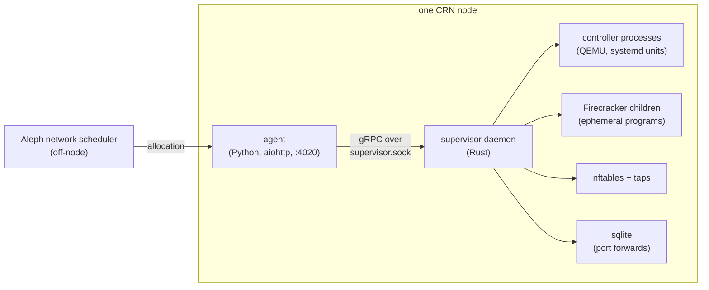

# Overview

> Verified against: b2b31381 (2026-08-14)

## What this covers

The front door into `docs/architecture/`: what aleph-vm is, how the pieces
on one compute-resource node (CRN) fit together, where the code for each
piece lives, and which of the other eight docs to read for a given
question. Each subsystem doc goes deep into its own model and invariants;
this one only orients.

## The model

aleph-vm turns Aleph network messages into running virtual machines on a
CRN. The Aleph network's scheduler decides, off-node, which VMs and
V-PROGRAMs belong on this node and pushes that allocation to the node's
agent. The agent resolves each allocation into a `CreateVmSpec` and drives
it into existence by calling the supervisor daemon over gRPC. The
supervisor owns every kernel-facing mechanism: it starts per-VM QEMU
controllers as systemd units, spawns ephemeral Firecracker programs as its
own child processes, writes nftables and TAP state, and persists port
forwards to sqlite.

The agent and the supervisor are separate processes joined only by the
gRPC contract; a Rust and a Python supervisor daemon both ship, selected at
boot by an environment variable, and either can adopt VMs a previous
instance left running with no VM downtime. [`process-model.md`](process-model.md)
is where this split, and the adoption model that makes it safe, is
described in full.

## Repo layout

| Path | Purpose |
|---|---|
| `src/` | The `aleph.vm` Python package: the agent, the Python supervisor daemon (still shipped), the `supervisor_interface` contract layer, and storage/network/vprogram support code. |
| `rust/crates/supervisor-daemon` | The Rust supervisor daemon: gRPC server, lifecycle RPCs, world view/adoption, networking, storage-pool validation, guest quiescence. |
| `rust/crates/supervisor-controller` | The Rust per-VM QEMU controller process, for persistent, confidential and SEV-SNP VMs. |
| `rust/crates/supervisor-cli` | `alephctl`, a standalone debug CLI that speaks the gRPC contract directly. |
| `rust/crates/supervisor-proto` | Protobuf/gRPC bindings, compiled fresh from `proto/supervisor.proto` on every build. |
| `rust/crates/aleph-tee` | The shared SEV-SNP attestation library: report retrieval, parsing, verification primitives. |
| `rust/crates/aleph-attest-agent` | The in-guest attestation sidecar that serves the attested TLS proxy for V-PROGRAM workloads. |
| `rust/crates/aleph-attest-cli` | The verifying client that chain-validates a guest's attested TLS certificate. |
| `proto/` | The `supervisor.proto` contract shared by both daemon implementations. |
| `packaging/` | systemd units, the implementation-dispatch launcher scripts, and `.deb`/Dockerfile build inputs. |
| `scripts/` | Codegen and CI helpers: proto binding generation, proto-drift checking, fixture generation, repo split. |
| `tests/` | The Rust-vs-Python conformance suite, the implementation-agnostic integration matrix, and Python unit/migration/network/vprogram suites. |

## Reading order

1. [`process-model.md`](process-model.md): the agent/supervisor process
   split, why the gRPC boundary is total, systemd unit topology, `alephctl`,
   and how a supervisor daemon rebuilds its world and reattaches to live
   VMs with zero downtime.
2. [`wire-contract.md`](wire-contract.md): the `proto/supervisor.proto`
   surface and its conventions, and the error model end to end, from a leaf
   `thiserror` enum to the `SupervisorError` subclass the agent catches.
3. [`vm-lifecycle.md`](vm-lifecycle.md): the four create paths, admission
   and capacity checks, the lifecycle state machine, stop/start/reboot
   semantics, reinstall/restore, backups (agent-owned), and what a delete
   leaves on disk.
4. [`networking.md`](networking.md): tap assignment and IPv4/IPv6
   derivation, the nftables ruleset the supervisor builds, port-forward
   persistence and healing, the NDP proxy, and per-VM DHCP for SEV-SNP
   guests.
5. [`storage.md`](storage.md): the volume-pool model spreading VM disks
   across multiple disks, the devmapper copy-on-write chain, cloud-init
   seed images, and cold-migration export/import artifacts.
6. [`confidential.md`](confidential.md): the SEV/SEV-ES/SEV-SNP launch
   paths, the attestation stack, measured Nix guest images and dm-verity,
   and how a V-PROGRAM message becomes a running attested VM.
7. [`testing.md`](testing.md): the five test layers from Rust unit tests
   to droplet CI, which workflow runs what, and why local verification is
   compile-only while CI is the real test gate.
8. [`divergences.md`](divergences.md): the living registry of deliberate
   Rust-vs-Python behavioral differences, numbered and referenced by tests.
