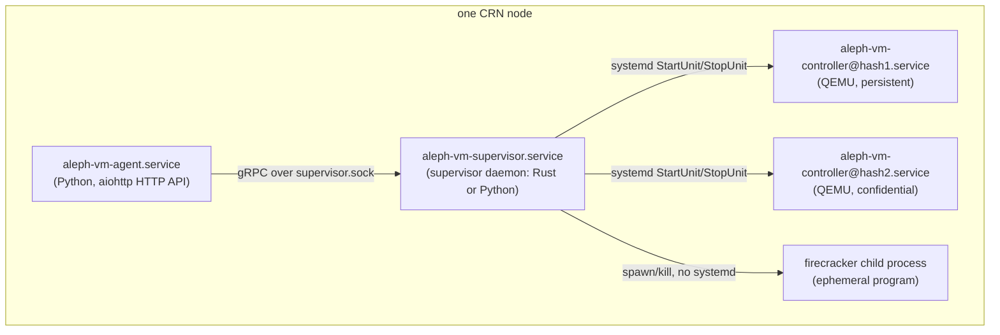

# Process model

> Verified against: b2b31381 (2026-08-14)

## What this covers

How a compute-resource node (CRN) is split into processes: the agent (Python,
aiohttp HTTP API) and the supervisor daemon (Rust, with a Python
implementation still shipping), the systemd unit topology that carries
per-VM controllers and how ephemeral programs differ from persistent VMs,
the `alephctl` debug CLI, and how a supervisor daemon rebuilds its view of
the world and reattaches to already-running VMs without downtime.

Everything below is per-node: each CRN runs exactly one agent and one
supervisor, talking over a local Unix socket. There is no multi-host or
remote supervisor.

## The model

### Two processes, one gRPC boundary

A node runs two long-lived processes plus one short-lived process per VM:

The agent (Python, `aleph.vm.agent`) and the supervisor daemon (Rust,
`rust/crates/supervisor-daemon`) are separate programs joined only by the gRPC
contract in `proto/supervisor.proto` and the Python DTO/ABC layer that mirrors
it, `src/aleph/vm/supervisor_interface/`. That layer is the floor: it imports
only stdlib, pydantic and wire value types, and an `import-linter` contract in
`pyproject.toml` forbids it from importing `aleph.vm.agent`, checked in CI.
There is no supervisor-side Python left to guard against: the Python daemon,
its VM pool, models, host-network plumbing and hypervisor wrappers were
removed in 2026-08 once the Rust daemon had become the only implementation
CI and the testnets ran. The on-disk controller-config schema
(`src/aleph/vm/supervisor_interface/configuration.py`) also lives in that
contract layer, because both sides need it: the agent writes
`{vm_hash}-controller.json`, the controller process reads it.

The split is a division of ownership, not just of code:

- The **agent** owns policy: what *should* be running. It resolves message
  content into a `CreateVmSpec` (`src/aleph/vm/agent/translate.py`,
  `vprogram_launch.py`), decides memory/vCPU/GPU admission
  (`src/aleph/vm/agent/capacity.py`), computes the desired port-forwarding
  set from the user's aggregate settings (`resolve_port_forwards` in
  `src/aleph/vm/agent/run.py`), runs idle-expiry and update-watching
  (`src/aleph/vm/agent/expiry.py`, `update_watcher.py`), drives HAProxy
  domain routing purely from `list_vms()` output
  (`src/aleph/vm/agent/haproxy_sync.py`), and persists its own
  owner/message/persistence knowledge in a local registry and database
  (`src/aleph/vm/agent/vm_registry.py`).
- The **supervisor** owns mechanism: what *is* running. It is the sole
  process that writes nftables state, manages TAP devices, spawns and
  supervises VM processes, and persists port-forward mappings; it applies,
  reports (`list_port_forwards`) and reapplies its own state on reattach.
  The two mechanism checks it keeps for itself at create time, both under
  `creation_lock` in `rust/crates/supervisor-daemon/src/lifecycle.rs`
  (`check_memory_backstop`, `validate_spec_gpus`): committed memory plus the
  new request must not exceed physical memory minus
  `HOST_MEMORY_RESERVED_MIB`, and a GPU cannot be attached twice.

All calls cross the boundary through the `Supervisor` ABC
(`src/aleph/vm/supervisor_interface/abc.py`, 8 capability groups, 29
methods); the concrete implementation the agent talks to is
`GrpcSupervisor` (`src/aleph/vm/supervisor_interface/client.py`), a client
over a Unix-domain-socket gRPC channel resolved from
`settings.SUPERVISOR_GRPC_SOCKET` (`src/aleph/vm/agent/supervisor.py`,
`build_supervisor`). There is no in-process implementation: every path,
including tests, goes through the socket.

### One daemon implementation

The Rust daemon (`rust/crates/supervisor-daemon`) and the Rust per-VM
controller (`rust/crates/supervisor-controller`) are the only supervisor-side
implementation and the systemd units exec their binaries directly
(`/opt/aleph-vm/bin/aleph-vm-supervisor`, `/opt/aleph-vm/bin/aleph-vm-controller`).
Until 2026-08 a Python daemon shipped alongside behind an
`ALEPH_VM_SUPERVISOR_IMPL` dispatch (default `python`, then `rust` as of
2.0); that daemon, the
launcher scripts and the flag are gone. A `supervisor.env` that still carries
`ALEPH_VM_SUPERVISOR_IMPL=...` is harmless: nothing reads it.

### systemd unit topology

Three unit shapes, all under `packaging/aleph-vm/etc/systemd/system/`:

- `aleph-vm-supervisor.service`: the pool owner, one per node, execs
  `/opt/aleph-vm/bin/aleph-vm-supervisor`.
- `aleph-vm-agent.service`: the HTTP API, `After=`/`Wants=` the supervisor
  unit.
- `aleph-vm-controller@.service`: a systemd *template* unit, one instance
  per persistent VM (`aleph-vm-controller@{vm_hash}.service`), execs
  `/opt/aleph-vm/bin/aleph-vm-controller` with `--config=/var/lib/aleph/vm/{vm_hash}-controller.json`.
  `KillMode=mixed` and `TimeoutStopSec=60`: SIGTERM reaches only the
  controller process, which sends an ACPI powerdown to the guest and falls
  back to a QMP `quit` if the guest does not respond, before systemd
  escalates to SIGKILL.

The supervisor daemon starts and stops controller units through systemd
(`enable_and_start`/`stop_and_disable` in
`rust/crates/supervisor-daemon/src/units.rs`, invoked from
`rust/crates/supervisor-daemon/src/lifecycle.rs`); it never links hypervisor
code into itself. This is the seam that lets the controller be ported (or
reimplemented) independently of the daemon: `supervisor-controller`
(`rust/crates/supervisor-controller/src/main.rs`) was ported from the
Python controller's QEMU and confidential-QEMU paths (removed with the
Python daemon in 2026-08): it parses the same `{vm_hash}-controller.json`,
waits for the daemon-created `vmtap{vm_id}` interface, spawns QEMU, and
blocks on it. (The config's `vm_id` field is the integer `vm_index`, not
the wire `vm_id`, which is the VM hash: see
`src/aleph/vm/supervisor_interface/configuration.py`.)

Ephemeral (non-persistent) Firecracker programs are different: they are
**direct child processes of the supervisor daemon**, not systemd units at
all (`rust/crates/supervisor-daemon/src/firecracker.rs`, ported from the
Python daemon's Firecracker `MicroVM` wrapper). Cold-boot latency for
on-demand programs is a competitive metric, and unit-creation overhead was
not worth adding during the port. The direct consequence: an ephemeral
program can never outlive the daemon that spawned it, and it is never
subject to adoption (only persistent, systemd-tracked VMs are adopted at
boot).

### alephctl

`alephctl` (`rust/crates/supervisor-cli`) is a standalone debug CLI that
speaks the gRPC contract directly over the supervisor's Unix socket, so it
works against either daemon implementation without the agent in the loop.
Socket resolution (`resolve_socket_path` in
`rust/crates/supervisor-cli/src/client.rs`) mirrors the daemon's own
settings resolution: `--socket` flag, then
`ALEPH_VM_SUPERVISOR_GRPC_SOCKET`, then
`{ALEPH_VM_EXECUTION_ROOT}/supervisor.sock`, then
`/var/lib/aleph/vm/supervisor.sock`; an empty environment value counts as
unset in both the CLI and the daemon's own `Settings` resolution
(`rust/crates/supervisor-daemon/src/config.rs`), so it finds the right
socket on a correctly configured node with zero flags.

### The gRPC socket itself

The daemon binds `supervisor.sock` under a restrictive `umask(0o077)` and
`chmod`s it to `0700` afterward as a backstop
(`rust/crates/supervisor-daemon/src/server.rs`): only root (the agent, also
running as root) may connect. Shutdown unlinks the socket only after
confirming (via an `O_PATH` descriptor pinned at bind time) that the path
still holds the inode this daemon bound, so a newer daemon instance that
re-bound the same path is never disturbed by an older instance's cleanup.

## Adoption and the zero-downtime model

A supervisor daemon (either implementation) can be stopped and a different
one started in its place while VMs keep running, with no VM restart. This is
possible because the daemon keeps no execution database of its own: on
startup it rebuilds its entire view of the world from the same sources of
truth both implementations already read and write.

### Rebuilding the world (adoption steps 1-4)

Before the gRPC socket is bound, `build_world_view`
(`rust/crates/supervisor-daemon/src/world.rs`) runs synchronously in
`rust/crates/supervisor-daemon/src/main.rs`:

1. Scan `{EXECUTION_ROOT}/*-controller.json` in sorted file-name order
   (`scan_controller_configs`).
2. Parse each file against the pydantic-mirrored schema in
   `controller_config.rs`. A file that fails to parse, is oversized or is
   not a regular file is logged and **skipped**, never fatal: an
   unparseable config crash-looping the daemon was a real incident the
   Python implementation hit (referenced inline in `world.rs` and
   `controller_config.rs`).
3. Batch-query systemd unit states for every discovered controller unit
   (one `ListUnits` D-Bus call through `rust/crates/supervisor-daemon/src/units.rs`).
   If that call fails outright (bus unreachable), no VM is stamped
   `STOPPED` from it: each VM's status instead defers to live per-RPC unit
   queries until the bus answers, rather than guessing.
4. Build one `VmEntry` per adopted config, keyed on the embedded
   `vm_hash`/`vm_id` (never the file name; here `vm_id` means the wire
   vm_id, i.e. the VM hash, not the config's integer `vm_id` field, which
   this doc calls `vm_index`). When two ACTIVE configs claim
   the same `vm_index`, only the first in sorted file order is adopted
   (`world.rs`, mirroring the Python `claimed_vm_ids` guard); the other's
   `vm_index` is still reserved out of the allocator so nothing can later
   collide with it. For each VM adopted running, this step also reads that
   VM's persisted port-forward rows straight out of the port-mapping
   sqlite store (`ports::load_port_forwards` in
   `rust/crates/supervisor-daemon/src/world.rs`, backed by
   `rust/crates/supervisor-daemon/src/ports.rs`) and attaches them to the
   `VmEntry`, so the world view is genuinely sourced from disk, systemd
   *and* sqlite together, before the socket ever binds.

A config whose controller unit is not active is still adopted and reported
`STOPPED`, not stopped-and-deleted: a read-only-at-boot daemon must not
destroy state it can't be sure is safe to destroy. GPUs referenced by
adopted controller configs are excluded from the "available" GPU inventory
before being attached back onto the corresponding `VmInfo`, so a restart can
never report an already-attached GPU as free.

### Reconciling kernel/service state (adoption step 5)

`reconcile_boot` (`rust/crates/supervisor-daemon/src/lifecycle.rs`) runs
inside the async runtime, still before the socket is bound. For every VM the
world view marked `adopted_running`, it creates the TAP device if absent,
primes the NDP proxy's in-memory range map, ensures the per-VM nftables
chain exists, and recreates the nftables redirect rules for the port
forwards already loaded from sqlite during world assembly (step 4 above,
not a second sqlite read here). Every step is **create-if-absent**, never
flush-and-rebuild: a full flush would drop live guest connections on VMs
that never stopped. If any step fails for a given VM, that VM is removed
from the in-memory world (hidden from `ListVms`, its `vm_index` kept
reserved) and queued in `failed_reattach` for retry, exactly mirroring a
failed Python reattach.

### The reattach retry loop

`main.rs` spawns a background loop
(`spawn_reattach_retry_loop`/`lifecycle::retry_failed_reattachments_once`)
that wakes every `REATTACH_RETRY_INTERVAL_SECONDS` (30s) while any queued VM
has not exhausted `REATTACH_RETRY_MAX_ATTEMPTS` (5) attempts, and
self-terminates once the queue is empty: a clean boot with nothing to
retry never spawns real work. Each pass re-checks the controller unit's
live state before retrying: `inactive`/`failed`/`not-loaded` means the
controller genuinely died since boot, so the daemon stops/disables the
stale unit and drops the retry (its on-disk config is left alone, per the
no-destruction rule); `active` attempts a full readopt
(`readopt_live_controller`); any other state (a D-Bus hiccup, a transitional
state) is treated as "not proof of death" and retried later. A VM that
exhausts its retries keeps running under its controller but stays
unmanaged by the supervisor until an operator intervenes; it is never
auto-stopped.

## Key invariants

- The agent and the supervisor communicate only through
  `aleph.vm.supervisor_interface`; neither side imports the other, enforced
  by an `import-linter` contract in `pyproject.toml` checked in CI.
- The supervisor is the sole writer of nftables and port-forward state; the
  agent only reads it back through `list_port_forwards` and never recreates
  persisted mappings itself (`src/aleph/vm/agent/run.py`,
  `resolve_port_forwards`/`reconcile_port_forwards`).
- Per-VM controller processes for persistent QEMU VMs run under the
  `aleph-vm-controller@.service` systemd template; the daemon only ever
  starts/stops the unit, never spawns or links hypervisor code directly
  (`rust/crates/supervisor-daemon/src/units.rs`,
  `rust/crates/supervisor-daemon/src/lifecycle.rs`).
- Ephemeral (non-persistent) Firecracker programs are direct child
  processes of the supervisor daemon with no systemd unit at all, and
  cannot outlive the daemon that spawned them
  (`rust/crates/supervisor-daemon/src/firecracker.rs`).
- A daemon that adopts must not destroy: an unparseable controller config
  is logged and skipped, never fatal
  (`rust/crates/supervisor-daemon/src/controller_config.rs`,
  `rust/crates/supervisor-daemon/src/world.rs`); a config whose unit is not
  active is kept and reported `STOPPED`, not deleted.
- Adoption and boot reconcile only ever create-if-absent kernel/service
  state for VMs already running; neither ever flushes and rebuilds
  (`rust/crates/supervisor-daemon/src/lifecycle.rs`, `reconcile_boot`).
- Concurrent creates cannot double-commit memory or double-attach a GPU:
  both `check_memory_backstop` and `validate_spec_gpus` run under
  `creation_lock` inside `create_vm`
  (`rust/crates/supervisor-daemon/src/lifecycle.rs`).
- The daemon and every controller read the same environment file
  (`/etc/aleph-vm/supervisor.env`), so one configuration governs both.
- The supervisor gRPC socket is bound under `umask 0o077` and `chmod 0700`;
  shutdown only unlinks the socket inode this daemon instance actually
  bound (`rust/crates/supervisor-daemon/src/server.rs`).

## Pointers into code

- `src/aleph/vm/agent/`: the aiohttp agent, HTTP views, message
  translation, capacity admission, expiry, update-watching, HAProxy sync,
  the owner registry.
- `src/aleph/vm/supervisor_interface/`: the contract layer, the
  `Supervisor` ABC (`abc.py`), the gRPC client (`client.py`), DTOs
  (`types.py`), the closed error vocabulary (`errors.py`), the on-disk
  controller config schema (`configuration.py`), wire conversion
  (`wire/proto_convert.py`).
- `rust/crates/supervisor-daemon/src/main.rs`,
  `rust/crates/supervisor-daemon/src/server.rs`,
  `rust/crates/supervisor-daemon/src/service.rs`,
  `rust/crates/supervisor-daemon/src/world.rs`: daemon entry point,
  socket/server lifecycle, shared `DaemonState`, world view construction.
- `rust/crates/supervisor-daemon/src/lifecycle.rs`: every lifecycle RPC
  implementation, plus `reconcile_boot`, `retry_failed_reattachments_once`
  and `readopt_live_controller` (adoption and reattach).
- `rust/crates/supervisor-daemon/src/units.rs`: systemd unit-state
  queries and start/stop, over D-Bus via `zbus`.
- `rust/crates/supervisor-daemon/src/firecracker.rs`: the ephemeral
  program launcher (direct child processes).
- `rust/crates/supervisor-controller/src/main.rs`: the Rust per-VM QEMU
  controller entry point.
- `rust/crates/supervisor-cli/`: `alephctl`, the direct-gRPC debug CLI.
- `packaging/aleph-vm/etc/systemd/system/`: the three unit files.
- `pyproject.toml`: the `[tool.importlinter]` contracts enforcing the
  agent/supervisor/contract boundary.
