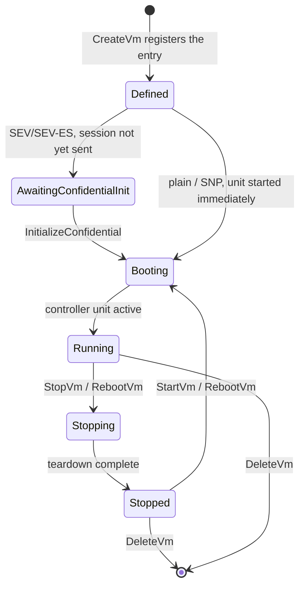

# VM lifecycle

> Verified against: b2b31381 (2026-08-14)

## What this covers

How a VM moves from a message/spec to a running guest and back: the four
create paths (persistent QEMU, confidential SEV/SEV-ES, SEV-SNP, ephemeral
Firecracker programs), admission and capacity checks, a summary of adoption
and boot reconcile (the deep story lives in
[`process-model.md`](process-model.md)), stop/start/reboot semantics,
reinstall and restore, the backup archive format and registry, and the rules
for what gets erased on delete. Networking mechanics (tap/IP derivation,
nftables) and the confidential attestation stack are covered in
[`networking.md`](networking.md) and [`confidential.md`](confidential.md);
this doc only describes how lifecycle operations invoke them.

Everything here is the Rust supervisor daemon
(`rust/crates/supervisor-daemon/src/lifecycle.rs`), a 1:1 port of the Python
`LocalSupervisor`/`VmExecution`/`VmPool` methods it replaces. Where behavior
is intentionally bug-for-bug with Python, that is called out.

## The model

### Create: four paths from one entry point

`create_vm` (`rust/crates/supervisor-daemon/src/lifecycle.rs`) always
normalizes the spec's wire paths first (`normalize_spec_paths`, matching
Python's `pathlib` ingestion), then dispatches on `backend` and `persistent`:

- **Firecracker + non-persistent** goes to `create_program_vm`: an ephemeral
  program.
- **Firecracker + persistent** is `Unimplemented`: persistent programs would
  need to boot under a systemd controller unit, which the Rust daemon does
  not yet support for Firecracker.
- **QEMU + non-persistent** is also refused: Python's equivalent path fails
  inside `AlephQemuInstance.start()` with `NotImplementedError`, so the Rust
  daemon refuses up front with the same wire shape instead of reproducing the
  crash.
- **QEMU + persistent** is the common case, and where confidential and SNP
  variants branch off the same code.

For the QEMU path, both `check_memory_backstop` and `require_rootfs` run
before any side effect, and the new `VmEntry` is registered in the world map
(allocating its `vm_index` and tap assignment) *before* the boot starts, the
same "register before prepare" ordering Python uses so a duplicate create or
a `ListVms` mid-boot sees the in-flight VM. The whole create runs under
`state.creation_lock`, then the VM's own per-VM lock; a request for a
`vm_id` that is already tracked and running returns the existing entry if
the spec matches byte-for-byte (`same_spec_or_conflict`), or
`AlreadyExists` if it does not. A request whose on-disk controller config
exists and whose systemd unit is `active`, but which the daemon does not
currently track, goes through `readopt_live_controller` instead of creating
a duplicate: this is the on-demand counterpart to boot-time adoption,
serving the case where a controller outlived a daemon crash or a failed
initial reattach.

The boot itself (tap creation, nftables chain setup, cloud-init seed,
controller-config write, NUMA drop-in, unit start) runs inside
`std::panic::catch_unwind`, so a panic mid-boot takes the same cleanup path
as an ordinary error: tap and nftables state are torn down, the NUMA
reservation is released, and the just-registered entry is removed. Nothing
about a failed create is left half-applied on disk except the controller
config and cloud-init seed, which Python's failure path also leaves behind
for the operator to inspect.

**Confidential SEV / SEV-ES** rides the same QEMU path but never starts the
controller unit at create time (`await_session = confidential && !snp`).
The written config carries the extra SEV fields; `create_vm` only stamps
`started_at_ns` and leaves the VM `awaiting_confidential_init`. The owner
must call `InitializeConfidential`, which writes `vm_session.b64` /
`vm_godh.b64` under the per-VM confidential session directory
(`confidential::session_dir`) and then enables and starts the controller
unit (`rust/crates/supervisor-daemon/src/confidential.rs`,
`initialize_confidential`). `GetMeasurement` and `InjectSecret` are QMP
passthrough to the running confidential QEMU and only answer against real
SEV hardware; the attestation stack itself is out of scope here (see
`confidential.md`).

**SEV-SNP** takes the opposite branch of the same `snp`/`confidential`
predicates: it has no session/GODH handshake (secrets are injected later
over the attested channel), so it starts immediately, exactly like a plain
VM. Two consequences follow directly from that: it skips the cloud-init
drive entirely (the measured Nix image boots via kernel+initrd with a
deterministic cmdline, and adding a cloud-init drive would break that
determinism), and it gets its IPv4 from a per-tap DHCP server started
alongside the tap (`dhcp::DhcpConfig::for_snp`) rather than from static
cloud-init network config. Every teardown path that tears down a tap for an
SNP VM also stops that VM's DHCP server; a `debug_assert_eq!` inside
`create_vm_inner` checks that the request-level `snp` predicate and the
written config's `snp()` predicate agree, because the two are computed
independently and a divergence would leak a DHCP server on a "plain" VM's
teardown path.

**Ephemeral Firecracker programs** (`create_program_vm`) are the odd path
out: no controller config is ever written, no persisted port mappings are
preloaded (fresh tap assignment every create), and the VM boots by spawning
a direct child process through `state.programs.boot`
(`rust/crates/supervisor-daemon/src/firecracker.rs`), not a systemd unit.
Registration, tap allocation and the panic-safe boot/cleanup structure
mirror the QEMU path, but there is no readopt probe: an ephemeral program
never survives on disk, so there is nothing to reattach to.

### Spec admission and capacity

Admission happens in two layers that never overlap in what they check:

- **Agent-side policy** (`src/aleph/vm/agent/capacity.py`,
  `CapacityManager.check_capacity`) runs before every `create_vm` call, after
  the spec is built (so a failed download or bundle fetch never consumes
  capacity). It enforces two-bucket memory accounting: instances (and
  V-PROGRAMs, which are full SNP VMs admitted against the instance bucket)
  share `physical - HOST_MEMORY_RESERVED_MIB - PROGRAM_MEMORY_RESERVED_MIB`;
  programs share `PROGRAM_MEMORY_RESERVED_MIB` alone. vCPUs are capped at
  `physical_cores * VCPU_OVERCOMMIT_FACTOR` across both buckets. Every real
  create-path caller in `src/aleph/vm/agent/run.py` (`create_vm_execution`,
  which covers instances, programs and V-PROGRAMs, and `_ensure_program_vm`,
  the on-demand program path) passes `disk_mib=0` and no `max_volume_mib`,
  so `check_capacity`'s disk checks no-op on create: disk is not actually
  gated at create time. `check_capacity` also implements an
  aggregate-free-space check and a single-largest-volume-fits-the-roomiest-
  pool check (`_check_max_volume`), but the only caller that exercises them
  with real figures is the separate `/control/reserve_resources` dry-run
  endpoint (`operate_reserve_resources` in
  `src/aleph/vm/agent/views/__init__.py`), which reports capacity ahead of a
  scheduler placement decision without creating anything. The VM's own
  early registry record (recorded before the spec build, to make owner-auth
  answerable during a slow confidential download) is excluded from the
  committed memory/vCPU sums via `exclude_vm_hash`, or a create would count
  its own request against itself. GPU admission is a separate reservation
  ledger (`CapacityManager.holds`, keyed by concrete `pci_host`) with a
  short-lived hold/resolve two-step: `reserve_gpus` (used by the same
  dry-run endpoint) holds a card for a user for `RESERVATION_TTL_SECONDS`,
  `resolve_gpus` (called from the create path) consumes the caller's own
  holds and skips cards held by another user. So create-time admission is,
  in practice, memory plus vCPUs plus GPU holds; disk admission is a
  dry-run-only feature of the same `CapacityManager`.
- **Supervisor mechanism backstops** (`check_memory_backstop`,
  `validate_spec_gpus` in `lifecycle.rs`) run under `creation_lock` inside
  `create_vm_inner` itself: committed memory (summed from every tracked
  `VmEntry.config.mem_size_mb`) plus the new request must not exceed
  physical memory minus `HOST_MEMORY_RESERVED_MIB`, and a GPU's `pci_host`
  must exist in the host inventory and not already be attached to (or
  claimed twice within) any tracked VM. These are the only two invariants
  the supervisor enforces for itself; everything else, including whether a
  request is *reasonable*, is agent policy. The ownership split (why this
  policy lives agent-side rather than in the supervisor) is described in
  `process-model.md`.

### Adoption and boot reconcile

A daemon restart never destroys or restarts a live VM. In short: at startup
the daemon rebuilds its world view from on-disk controller configs plus
systemd unit states, `reconcile_boot` recreates any missing tap/nftables
state (plus persisted port-redirect rules) for VMs it adopted running
(create-if-absent, never flush-and-rebuild), and any VM that fails
reconciliation is hidden from the world and queued for background retry
rather than torn down. `reconcile_boot` never touches DHCP: an SNP VM's
per-tap dnsmasq runs as its own transient systemd unit
(`aleph-vm-dhcp-{vm_hash}.service`, started via `systemd-run`), independent
of the daemon process, so it survives a daemon restart on its own and needs
no boot-time reconciliation; only `create_vm`/`start_vm` (re)start it, and
only the teardown paths stop it. The full mechanism, including the
retry loop's liveness gating and give-up behavior, is described in
[`process-model.md`](process-model.md#adoption-and-the-zero-downtime-model);
`create_vm` also participates in it directly through
`readopt_live_controller`, used both for an on-demand create racing a live
untracked controller and for each retry pass.

### Status derivation and the lifecycle state machine

A VM's reported `VmStatus` is never stored directly; it is derived on every
read from the entry's `VmTimes` (`defined_at_ns`, `preparing_at_ns`,
`prepared_at_ns`, `starting_at_ns`, `started_at_ns`, `stopping_at_ns`,
`stopped_at_ns`) plus a live "is the unit active" check
(`crate::service::vm_status`, ported literally from Python's `_status_of`):
a non-zero `stopped_at` wins outright, then a non-zero `stopping_at`, then
"running" if the unit is live, then `Booting` if `starting_at` is set but the
unit is not yet live, else `Defined`. `awaiting_confidential_init` is a
separate boolean, not a `VmStatus` variant: true exactly when the VM is
confidential (SEV/SEV-ES only, never SNP), persistent, has been started but
is neither stopping nor observed running.

(`DeleteVm` is drawn only from `Stopped`/`Running` above for readability; the
code has no status precondition on it at all, it accepts a VM in any state,
including mid-boot or awaiting confidential init, and stops whatever is
running before tearing down.)

### Stop, start, reboot: stop means stop

`StopVm` on a persistent QEMU VM is idempotent (a VM with `stopped_at_ns`
already set is a no-op) but otherwise a real teardown, not a status flip:
`stop_vm_execution` (`lifecycle.rs`) stops and disables the systemd unit,
waits for it to actually leave the active state, removes every nftables
port-forward rule for the VM, stops its per-tap DHCP server if it is SNP,
tears down the VM's nftables chain, and deletes the tap device. What
survives a stop, deliberately, is the VM's *definition*: the on-disk
controller config and cloud-init seed stay (only `DeleteVm` removes them),
and the NUMA reservation plus its `AllowedCPUs` drop-in are never released on
stop (`entry.numa_node` and its pinned vCPUs are still reserved by
`reconcile_numa_ledger`'s bookkeeping after a stop, and a later create over
the same `vm_id` explicitly releases and re-places rather than double
counting). `StartVm` clears the stop timestamps, recreates any missing
tap/nftables/DHCP state, restarts the unit and waits for it, then reloads
the VM's persisted port forwards from sqlite and reapplies their nftables
rules. An already-running `StartVm` short-circuits with no event emitted,
matching Python's no-op.

`RebootVm` differs by backend for a structural reason: a persistent QEMU VM
has a restart primitive (`RestartUnit`), so reboot is `RestartUnit` plus a
wait for the unit to become active again, with the VM's timestamps
re-stamped and **two** events emitted (down, then up), because a watcher
that drops its per-VM state on "down" must actually observe the down before
the up. An ephemeral Firecracker program has no such primitive: its "reboot"
stops the program, discards its world entry entirely, and recreates it fresh
from the spec the entry was still holding, complete with a new `vm_index`
and a new tap, rather than returning a stopped husk the caller would then
have to restart. `StopVm` and `StartVm` on an ephemeral program are flatly
`Unimplemented`: "the cycle is DeleteVm + CreateVm". There is no meaningful
"stopped but still defined" state for a program (no on-disk config, no
systemd unit to restart), so the daemon refuses rather than faking one.

### Idle expiry

Idle teardown is agent policy, not something the supervisor knows about: the
supervisor has no concept of "idle" (persistence itself is read from the
agent's registry, not carried on `VmInfo`, per `process-model.md`). The
agent's `ExpiryManager` (`src/aleph/vm/agent/expiry.py`) holds one
`asyncio.Task` per `vm_id`, armed with `settings.REUSE_TIMEOUT` after each
request an on-demand program serves (`src/aleph/vm/agent/run.py`,
`run_code_on_request`/`run_code_on_event`); persistent VMs are never
scheduled for expiry (`if not persistent: expiry.schedule(...)`). Every
handler that is about to serve a VM cancels its pending timer first
(`expiry.cancel(vm_id)  # do not reap a VM we are about to serve`) and
re-arms a fresh one in the request's `finally` block, so a timer only ever
fires after a VM has sat idle for the full window with no intervening
request. When it fires, `_expire` reaps the VM through
`self.supervisor.delete_vm(vm_id)` with no `wipe` argument, which defaults
to `wipe=False` (`src/aleph/vm/supervisor_interface/abc.py`): an idle reap
tears the VM down and releases its definition but never erases its
persistent data volumes, only its (already-ephemeral) rootfs disk stays
gone via the normal delete path. Each timer task removes only its own dict
entry on exit (a current-task identity check in the `finally`), so a
concurrent re-schedule that already replaced the entry is never clobbered,
and `VmNotFoundError` during the reap is treated as success (the VM is
already gone, nothing to do). `UpdateWatcher`
(`src/aleph/vm/agent/update_watcher.py`) is `ExpiryManager`'s sibling and
follows the identical cancel/finally discipline for a different trigger
(the watched Aleph message being updated); each cancels the other's timer
on a successful reap via the `on_reaped` callback, so reaping through one
path never leaves the other's subscription or timer leaking.

### Reinstall and restore

`ReinstallVm` always erases and rebuilds the rootfs; whether it also erases
writable data volumes is the caller's `wipe_volumes` flag. For a persistent
QEMU VM: stop, `erase_volumes(include_rootfs=true, include_data_volumes=wipe_volumes)`,
re-stamp the preparation timestamps, start again. For an ephemeral program:
stop, drop the world entry, erase the rootfs (data volumes are never in
scope for a program's `erase_volumes` call, see below), and return the
stopped result for the agent to recreate through the create path, since the
agent (not the supervisor) holds the message a program needs to be rebuilt
from.

`RestoreBackup` and `RestoreFromImage` are QEMU-persistent-only operations
(a program's rootfs-path resolution fails with `InvalidBackend`): both stop
the VM if it is running, swap the rootfs file (from a backup archive's
`rootfs.qcow2` member, or from an already-staged, `qemu-img check`-verified
QCOW2 upload), and start it again. `RestoreFromImage` additionally rejects
an upload whose virtual size exceeds the VM's declared rootfs size, since a
restore must never grow the disk. Both hold the VM's per-VM backup disk lock
(`state.backups.vm_lock`, shared with a running `StartBackup`) across the
swap, so a restore and a backup of the same VM's disks can never race.

### Backups: archive format, registry, download

A backup is one uncompressed `tar` archive per run, containing a
`qemu-img convert -c` compressed copy of the VM's rootfs
(`rootfs.qcow2`) plus, when `include_volumes` is set, one compressed member
per non-read-only host volume. Alongside the `.tar` sit a `.tar.sha256`
checksum sidecar and a `.tar.meta.json` metadata sidecar (`vm_hash`,
`created_at`, per-member `source_sizes`). The archive on disk is the record
of truth; only in-flight (`RUNNING`) and `FAILED` runs live in the
in-process `BackupRegistry` (`rust/crates/supervisor-daemon/src/backup.rs`).
The format is deliberately cross-readable between the Rust and Python
daemons (either can read the other's archive and verify it against its own
recorded checksum), but the exact tar bytes are not guaranteed identical,
since the Rust `tar` crate and Python's `tarfile` differ in PAX header
encoding.

`StartBackup` is idempotent twice over: a running job for the VM is returned
as-is, and a non-expired existing archive (`BACKUP_TTL_HOURS = 24`) is
returned without doing any work, both checked once unlocked (fast path) and
again under the registry's admission lock (so two concurrent `StartBackup`
calls can never both spawn a run). Archives, and their stale intermediate
`.qcow2`/`.restore.qcow2` transients, are swept by TTL both when a new
backup starts and, for the transients, as robustness against a daemon killed
mid-run. `ListBackups` merges the on-disk archives with the in-memory jobs;
`DownloadBackup` streams the tar in `BACKUP_DOWNLOAD_CHUNK_BYTES` (1 MiB)
chunks with byte offsets so a client can detect gaps and resume.
`DeleteBackup` refuses while the backup is `RUNNING` and otherwise removes
the archive and both sidecars. Guest fs-freeze around the disk copy
(`quiesce_guest`) is best-effort over the QEMU guest agent socket: an
unavailable agent is a warning, not a failure, and the backup proceeds
unfrozen.

### Erase-on-delete rules

`DeleteVm(wipe)` has an asymmetry worth stating precisely, because it is
easy to assume delete-with-wipe erases everything: it does not erase the
rootfs. It only ever erases writable (non-read-only) host volumes, and only
when `wipe` is true (`erase_volumes(&entry, include_rootfs=false,
include_data_volumes=wipe)` in `delete_tracked_vm`); the comment there is
explicit: "writable data volumes go, the rootfs stays." Contrast this with
`ReinstallVm`, which always erases the rootfs regardless of `wipe_volumes`.
For an ephemeral program, `erase_volumes` resolves the program's spec-held
`ROOTFS` disk path but always returns an empty volume list (a program's
`EXTRA` disks are never candidates), and `DeleteVm` always calls it with
`include_rootfs=false`; the practical result is that `DeleteVm` never
erases any disk belonging to a program, wipe or not. Only `ReinstallVm`'s
program branch, which forces `include_rootfs=true`, actually erases a
program's rootfs.

What `DeleteVm` always does, regardless of `wipe`: stop the VM (tearing down
its network state exactly as `StopVm` would), remove the world entry, remove
the NUMA reservation and its `AllowedCPUs` drop-in (unlike a stop, a delete
does release these), remove the on-disk controller config plus cloud-init
seed plus the dead monitor/QMP/QGA control sockets
(`controller_config::remove_controller_configuration`), and reap the VM's
backup registry entry so no stale job or disk lock outlives it. Persisted
port-forward mappings are deleted unless the caller passes
`keep_port_mappings=true` *and* `wipe` is false; `wipe=true` always deletes
them even if the caller asked to keep them. `keep_port_mappings=true` is used by callers that redeploy the same `vm_id`
right after deleting it: the agent's update-watcher reap (a message update
is a delete+recreate, not a real deallocation,
`src/aleph/vm/agent/update_watcher.py`) and `start_persistent_vm`'s crash
recovery, which deletes and recreates a persistent VM found in the terminal
`FAILED` state so the recreated VM reloads the same host ports
(`src/aleph/vm/agent/run.py`).

A `DeleteVm` against a VM the daemon never adopted (a "hidden" VM left over
from a failed boot-time reattach) is a distinct code path: it stops and
disables the stale controller unit directly, stops its DHCP server if it was
SNP, releases the reserved `vm_index` and drops its retry-queue entry, and
removes the controller config, all serialized under `creation_lock` against
the reattach retry loop. It deliberately never touches the NUMA ledger: a
hidden VM was never registered into it (`reconcile_numa_ledger` only
registers adopted-*running* tracked entries), so releasing a reservation for
it would steal capacity from a co-located VM that legitimately holds it.

## Key invariants

- Create-time mechanism checks (`check_memory_backstop`,
  `validate_spec_gpus`, `require_rootfs`) run before any side effect and
  under `creation_lock`, so a failed admission never leaves a half-registered
  entry or a leaked tap (`rust/crates/supervisor-daemon/src/lifecycle.rs`).
- A confidential VM (SEV/SEV-ES) never starts its controller unit at create
  time; only `SNP` starts immediately, because only SNP has no
  session/GODH handshake to wait for
  (`rust/crates/supervisor-daemon/src/lifecycle.rs`,
  `rust/crates/supervisor-daemon/src/confidential.rs`).
- `StopVm` tears down live network/process state completely but preserves
  the VM's on-disk definition and its NUMA reservation; only `DeleteVm`
  removes the definition, and only `DeleteVm` releases the NUMA reservation
  (`rust/crates/supervisor-daemon/src/lifecycle.rs`).
- `StopVm`/`StartVm` on an ephemeral Firecracker program are `Unimplemented`;
  the only supported cycle for a program is `DeleteVm` + `CreateVm`
  (`rust/crates/supervisor-daemon/src/lifecycle.rs`).
- `DeleteVm(wipe=true)` erases writable data volumes but never the rootfs;
  only `ReinstallVm` erases the rootfs, unconditionally
  (`rust/crates/supervisor-daemon/src/lifecycle.rs`).
- Restore operations (`RestoreBackup`, `RestoreFromImage`) and a running
  backup share one per-VM disk lock, so a restore's rootfs swap and a
  backup's disk read can never interleave
  (`rust/crates/supervisor-daemon/src/backup.rs`).
- A backup archive on disk is the record of truth; the in-memory registry
  only ever holds `RUNNING` or `FAILED` runs, never `COMPLETE` ones
  (`rust/crates/supervisor-daemon/src/backup.rs`).
- Deleting a hidden (never-adopted) VM never touches the NUMA ledger, since
  it was never registered into it
  (`rust/crates/supervisor-daemon/src/lifecycle.rs`).
- Agent-side capacity admission excludes the VM's own early registry record
  from its committed-resource sums, so a create never counts its own
  request against itself (`src/aleph/vm/agent/capacity.py`).

## Pointers into code

- `rust/crates/supervisor-daemon/src/lifecycle.rs`: every lifecycle RPC
  (`create_vm`, `stop_vm`, `start_vm`, `reboot_vm`, `reinstall_vm`,
  `restore_backup`, `restore_from_image`, `delete_vm`,
  `add_port_forward`/`remove_port_forward`), plus adoption/reconcile
  (`reconcile_boot`, `retry_failed_reattachments_once`,
  `readopt_live_controller`).
- `rust/crates/supervisor-daemon/src/world.rs`: `VmEntry`, `VmTimes`, the
  world map and its NUMA/reservation bookkeeping.
- `rust/crates/supervisor-daemon/src/backup.rs`: the backup archive format,
  `BackupRegistry`, `start_backup`/`list_backups`/`resolve_download`/
  `delete_backup`, and the `DiskTools` (`qemu-img`) seam.
- `rust/crates/supervisor-daemon/src/confidential.rs`: `initialize_confidential`,
  `get_measurement`, `inject_secret`.
- `rust/crates/supervisor-daemon/src/controller_config.rs`:
  `save_controller_config`, `remove_controller_configuration`, and the
  on-disk config schema.
- `rust/crates/supervisor-daemon/src/firecracker.rs`: ephemeral program
  boot (`ProgramBootRequest`, `state.programs.boot`).
- `rust/crates/supervisor-daemon/src/service.rs`: status derivation
  (`vm_status`, `vm_info_message`, `awaiting_confidential_init`).
- `src/aleph/vm/agent/capacity.py`: `CapacityManager` (memory/vCPU/disk
  admission, the GPU reservation ledger).
- `src/aleph/vm/agent/expiry.py`, `src/aleph/vm/agent/update_watcher.py`:
  agent-owned idle-teardown timers and update-triggered redeploys, both
  reaping through `supervisor.delete_vm`.
- `src/aleph/vm/agent/run.py`: `_ensure_program_vm`, `run_code_on_request`,
  `run_code_on_event`, `start_persistent_vm`: where capacity admission,
  `REUSE_TIMEOUT` expiry scheduling and update-watching are wired around the
  create/run/reap cycle.
- `src/aleph/vm/agent/translate.py`, `vprogram_launch.py`: message-to-spec
  translation for instances, programs and V-PROGRAMs.
