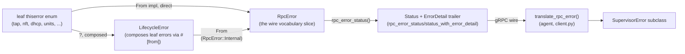

# Wire contract

> Verified against: b2b31381 (2026-08-14)

## What this covers

The `proto/supervisor.proto` contract between the agent and the supervisor
daemon: its RPC surface and the conventions baked into the message shapes,
and the error model end-to-end, from a leaf module's `thiserror` enum in the
Rust daemon (or a backend exception in the Python daemon) through to the
`SupervisorError` subclass the agent catches. It also covers two small but
load-bearing conventions in the Rust supervisor-daemon codebase: how error
`Display` text is logged at the process boundary, and how test fakes inject
failures.

## The model

### The contract surface

`proto/supervisor.proto` defines one gRPC service, `Supervisor`, grouped into
host, VM lifecycle, port forwarding, events, logs, backups, confidential and
network RPCs. The proto's own header states the **same-host invariant**: this
is a process boundary, not a network boundary, so every path-carrying field
(`kernel_path`, `DiskConfig.path`, `TeeConfig.session_dir`,
`VmInfo.guest_channel_path`) is exchanged by reference and must resolve
identically on both sides.

Both implementations compile from the one proto file, but not the same way:

- The **Python** bindings (`src/aleph/vm/supervisor_interface/wire/_pb/`) are
  generated ahead of time by `scripts/generate_proto.py` and checked into
  git. CI enforces this stays current: `scripts/check_proto_clean.sh`
  reruns the generator and fails the build if `supervisor_pb2.py` or
  `supervisor_pb2_grpc.py` differ from what's committed. The `.pyi` stub is
  deliberately excluded from that check (mypy-protobuf's output differs
  across Python versions); it is best-effort only.
- The **Rust** bindings (`rust/crates/supervisor-proto`) are never checked
  in. `rust/crates/supervisor-proto/build.rs` compiles `proto/supervisor.proto`
  in place with `tonic_build` on every build, adding a blanket
  `#[derive(serde::Serialize)]` so `alephctl --json` has something to
  serialize.

A handful of proto-level design choices are worth naming because they show
up repeatedly in the RPC surface:

- `Backend` (the VMM: Firecracker or QEMU) and `TeeConfig` (attestation) are
  orthogonal. There is no `BACKEND_QEMU_SEV`; a confidential VM is
  `backend: BACKEND_QEMU` plus a present `TeeConfig`.
- `DiskConfig.DiskRole` collapses to `ROOTFS`/`EXTRA` only. Everything past
  "which disk boots" is client vocabulary; non-root disks attach in spec
  order, which is how deterministic guest device names get assigned.
- `VmSpec.guest_channel` (a `GuestChannel` message) replaced an earlier
  boolean: the supervisor exposes a host UDS channel and waits for the
  guest's ready signal on `ready_port` before reporting `RUNNING`, but the
  bytes of that ready signal (`VmInfo.guest_ready_payload`) are opaque to
  the supervisor; only the client parses them. `GuestChannel.ready_timeout_secs`
  is boot-time policy that crosses the wire because it is workload policy
  the client owns, not something the supervisor can guess.
- `ConfidentialMode` and `VmInfo.gpus` stay precise (an enum and an exact
  PCI device list) rather than pre-reducing to booleans; any lossy
  reduction for Aleph-facing APIs happens agent-side.
- `ReinstallVmRequest.wipe_volumes` is `optional bool` specifically so the
  server can distinguish "unset" from "false" and apply its own default,
  avoiding the proto3 zero-value ambiguity a plain `bool` would have.
- `CreateVm` is idempotent on `vm_id`: resending the same spec for a live VM
  returns its current `VmInfo`; a different spec, or a collision, fails
  `ALREADY_EXISTS`. `StopVm`/`StartVm` exist because a persistent VM's
  definition survives a stop (it stays listed `STOPPED`); for ephemeral
  Firecracker programs those two RPCs are `UNIMPLEMENTED` because their
  lifecycle is `DeleteVm` then `CreateVm`.
- `WatchEvents` is a no-replay server stream: a client snapshots with
  `ListVms` first, then watches. Every unary RPC carries a client-side
  deadline (`QUERY_TIMEOUT_SECS` / `LIFECYCLE_TIMEOUT_SECS` in
  `src/aleph/vm/supervisor_interface/client.py`); streams (logs, events,
  backup download) carry none.
- `LogChunk.timestamp_ns` is stamped at capture time, not delivery time, so
  replayed journal history is not restamped with wall-clock time when it is
  streamed back later.

### The error model end-to-end

The proto closes the error vocabulary with an `ErrorCode` enum and an
`ErrorDetail` message (`code`, `message`, `vm_id`), because a gRPC status
code alone is too coarse to reproduce the HTTP responses the agent used to
derive from backend exception classes.

**Rust daemon.** Each leaf module owns its own `thiserror` enum
(`TapError`, `NftError`, `DhcpError`, `NdppdError`, `UnitsError`,
`PortsError`, `world::WorldError`, `BackupError`, `FirecrackerError`,
`QmpError`, `LogsError`, `CloudInitError`, `ConfigWriteError`/`ConfigParseError`
in `controller_config.rs`, `ChecksError`, `HugepagesError`, `DnsError` in
`net.rs`). `rust/crates/supervisor-daemon/src/lifecycle.rs` defines two more
types on top:

- `LifecycleError` composes several leaf error types transparently (`#[from]`
  on `UnitsError`, `world::WorldError`, `nft::NftError`,
  `nft::NoBaseChainFound`, `crate::tap::TapError`, `crate::ndppd::NdppdError`,
  `dhcp::DhcpError`, `ports::PortsError`, `cloudinit::CloudInitError`,
  `controller_config::ConfigWriteError`), plus its own variants for
  lifecycle-specific failures (`CrashLoop`, `UnitFailed`, `NotActive`,
  `NoEntry`, `EraseRootfs`, `EraseVolume`, `ControllerStart`, `Panic`,
  `Numa`). It exists so a leaf's `Display` text reaches the wire unchanged,
  rather than passing through a `.map_err(|e| e.to_string())` hop.
- `RpcError` is the actual wire vocabulary slice the gRPC layer speaks:
  `NotFound`, `AlreadyExists`, `InsufficientResources`, `InvalidBackend`,
  `BackupNotFound`, `MicroVmInit`, `Unimplemented`, `Internal`. Every
  `RpcError` variant's `Display` is `{0}` verbatim: "every payload IS the
  message that reaches the client" (the enum's own doc comment). A
  `LifecycleError` collapses into `RpcError::Internal(error.to_string())`;
  several leaf error types also have a direct `From` impl straight to
  `RpcError::Internal` for callers that return `Result<_, RpcError>` without
  composing through `LifecycleError` first (`impl From<UnitsError> for
  RpcError`, `impl From<crate::tap::TapError> for RpcError`, and similarly
  for `world::WorldError`, `dhcp::DhcpError`, `ports::PortsError`,
  `controller_config::ConfigWriteError`/`ConfigParseError`,
  `crate::backup::BackupError`, `crate::qmp::QmpError`,
  `crate::firecracker::FirecrackerError`, `crate::error::DaemonError`).

`rust/crates/supervisor-daemon/src/service.rs` turns an `RpcError` into a
gRPC `Status`: `rpc_error_status` matches each variant onto a `tonic::Code`
and a `pb::ErrorCode`, then `status_with_error_detail` builds a `pb::ErrorDetail`,
encodes it, and attaches it as a binary metadata trailer under the key
`ERROR_TRAILER_KEY` (`"aleph-supervisor-error-bin"`, defined once in
`rust/crates/supervisor-proto/src/lib.rs` and mirrored by the same literal in
`src/aleph/vm/supervisor_interface/wire/__init__.py`). `run_lifecycle` is the
seam every lifecycle RPC handler goes through: it runs the blocking
lifecycle operation on the blocking pool and maps its `Result<_, RpcError>`
through `rpc_error_status`.

**Python daemon (the oracle this mirrors).** Backend exceptions
(`InsufficientResourcesError`, `MicroVMFailedInitError`, `HostNotFoundError`,
...) are translated by `translate_exception`/`translating_errors` in
`src/aleph/vm/supervisor/error_mapping.py` into the closed
`SupervisorError` vocabulary defined in
`src/aleph/vm/supervisor_interface/errors.py` (one subclass per `ErrorCode`
value; the split exists because `errors.py` lives in the contract layer with
no backend dependency, while `error_mapping.py` stays supervisor-side since
it imports controller/hypervisor exception types). `src/aleph/vm/supervisor/grpc_server.py`'s
`_abort` looks up the gRPC status via `STATUS_CODE_BY_ERROR` (keyed on
`error.code`, with `NotImplementedSupervisorError` special-cased to
`UNIMPLEMENTED` since it shares `ErrorCode.INTERNAL` on the wire), builds a
`pb.ErrorDetail`, and aborts the RPC with that trailer attached under the
same `ERROR_TRAILER_KEY`.

**Client (agent).** `translate_rpc_error` in
`src/aleph/vm/supervisor_interface/client.py` rebuilds the precise
`SupervisorError` subclass a server-side abort carried: `UNIMPLEMENTED` wins
outright (it is the only signal distinguishing
`NotImplementedSupervisorError` from a generic internal error, since both
carry `ErrorCode.INTERNAL`); otherwise it reads the trailing metadata for
`ERROR_TRAILER_KEY`, decodes the `ErrorDetail`, and looks the code up in
`ERROR_CLASS_BY_CODE`. When no trailer is present at all, it falls back to
`ERROR_CLASS_BY_STATUS`, a coarser table keyed on the plain
`grpc.StatusCode`, so a server that aborts without a trailer still resolves
to a sensible class instead of raising bare `AioRpcError`.

### Byte-pinned Python-parity messages

Two RpcError constructions are pinned exactly, not just structurally:

- `RpcError::NotFound(vm_id.into())`: the message is the bare `vm_id`, no
  extra formatting, mirroring Python's `VmNotFoundError(vm_id)` whose
  `str()` is the vm_id itself. Every `entry_snapshot(...).ok_or_else(...)`
  call site in `lifecycle.rs` constructs it this way.
- `RpcError::MicroVmInit(String::new())`: an empty `Display`, mirroring
  `MicroVMFailedInitError` raised with no message in the Python controller.

Both are asserted directly by unit tests in
`rust/crates/supervisor-daemon/src/lifecycle.rs` (`assert_eq!(id, vm_id)` on
the `NotFound` payload, `assert_eq!(message, "")` on the `MicroVmInit`
payload) and by
`tests/conformance/test_rust_daemon_lifecycle.py`, which drives the Rust
daemon and asserts it raises the same `SupervisorError` subclasses the
Python `LocalSupervisor` error mapping does. More broadly, every `Display`
template introduced when these errors were typed in Rust was written to
reproduce the previous Python-generated string, because the rendered
`Display` is literally the message the client receives
(`require_rootfs` in `lifecycle.rs` notes this explicitly for the
`InvalidBackend`/`INVALID_ARGUMENT` case: "message texts are byte-identical").

### Self-contained Display, plain sink

`LifecycleError`'s leaf variants are `#[error(transparent)]`, which makes
`thiserror` both render the leaf's `Display` inline (so composed error text
reads exactly like the leaf produced it) and auto-link the leaf as
`Error::source()`. That combination is why the top-level log sink in both
daemon binaries logs with a plain `Display` (`tracing::error!(%error, ...)`
in `rust/crates/supervisor-daemon/src/main.rs`, `tracing::error!("{error}")`
in `rust/crates/supervisor-controller/src/main.rs`) instead of anyhow's
alternate `{:#}` form: `{:#}` walks the `source()` chain and reprints each
source again, and since these `Display` templates already inline their
sources, switching to `{:#}` without first stripping the embedded text
would double-print (e.g. "cannot open X: msg: msg"). Both `main.rs` files
carry this exact comment, cross-referencing each other.

`anyhow` is confined to the process top level: `run()` in each `main.rs`
returns `anyhow::Result`, but nothing below the RPC boundary uses an
untyped string error. The blanket `impl From<String> for RpcError` was
deleted specifically so the compiler enforces that no untyped error can
reach the wire (`LifecycleError`'s doc comment in `lifecycle.rs` notes this
is "exactly what the removed `impl From<String> for RpcError` did").

### Typed failure injection for fakes

Test fakes for the daemon's kernel-facing backends inject failures as a
freshly constructed value of the module's *own* error type, built by a
closure, rather than a fabricated catch-all string variant. `tap.rs`'s
`FakeTapBackend`, `dhcp.rs`'s `FakeDhcpBackend` and `nft.rs`'s
`StaticRuleset` each keep a `type <X>ErrorFn = Box<dyn Fn() -> <X>Error +
Send + Sync>` and expose methods like `fail_create`/`fail_batches_containing`
that take `impl Fn() -> <X>Error + ...` and call it again on every matching
operation. The reason it is a builder and not a stored value: these error
types deliberately have no `Clone` impl (an `io::Error` or
`serde_json::Error` source must stay a real, non-reconstructed error
everywhere outside the injection path), so a repeated failure is produced by
invoking the closure again rather than cloning a stored error.

This replaced a fabricated `Injected(String)` variant that used to exist on
`TapError`, `NftError`, `DhcpError`, `NdppdError` and `LogsError`: a fake
could previously report an arbitrary string that no real code path would
ever produce, silently drifting away from what production errors actually
look like. Dropping those variants means every failure a test injects is a
value the real backend could genuinely construct.

## Key invariants

- The error vocabulary crossing the wire is closed: every `RpcError` variant
  (`rust/crates/supervisor-daemon/src/lifecycle.rs`) maps to exactly one
  `pb::ErrorCode`, enforced by the match in `rpc_error_status`
  (`rust/crates/supervisor-daemon/src/service.rs`); the Python side enforces
  the same one-to-one mapping through `STATUS_CODE_BY_ERROR`
  (`src/aleph/vm/supervisor/grpc_server.py`).
- The `ErrorDetail` trailer, not the gRPC status code, carries the precise
  error class; the status code is only a fallback for a client that reads
  no trailer (`translate_rpc_error` in
  `src/aleph/vm/supervisor_interface/client.py`).
- `RpcError::NotFound` always carries the bare `vm_id` and
  `RpcError::MicroVmInit` always carries an empty message, pinned by unit
  tests and the conformance suite
  (`rust/crates/supervisor-daemon/src/lifecycle.rs`,
  `tests/conformance/test_rust_daemon_lifecycle.py`).
- No untyped string error can reach the wire: `RpcError` has no
  `From<String>` impl; every conversion into it is a named `From<LeafError>`
  that renders that leaf's own `Display`
  (`rust/crates/supervisor-daemon/src/lifecycle.rs`).
- The top-level log sink in both daemon binaries renders errors with plain
  `Display`, never anyhow's `{:#}`, because the error types' `Display`
  templates already inline their sources
  (`rust/crates/supervisor-daemon/src/main.rs`,
  `rust/crates/supervisor-controller/src/main.rs`).
- Test failure injection always constructs a real variant of the module's
  own error type via a builder closure; no module keeps a fabricated
  catch-all `Injected` variant for this purpose
  (`rust/crates/supervisor-daemon/src/tap.rs`,
  `rust/crates/supervisor-daemon/src/dhcp.rs`,
  `rust/crates/supervisor-daemon/src/nft.rs`).
- The Python generated proto bindings are checked into git and CI fails the
  build if they drift from `proto/supervisor.proto`
  (`scripts/check_proto_clean.sh`); the Rust bindings are never checked in
  and are compiled fresh from the same proto file on every build
  (`rust/crates/supervisor-proto/build.rs`).
- Every path-carrying field in the contract is valid only because agent and
  supervisor share a filesystem; the proto documents this as the same-host
  invariant (`proto/supervisor.proto`).

## Pointers into code

- `proto/supervisor.proto`: the contract itself, RPC groups, message shapes,
  the closed `ErrorCode` enum and `ErrorDetail`.
- `rust/crates/supervisor-proto/src/lib.rs`,
  `rust/crates/supervisor-proto/build.rs`: the Rust bindings crate and its
  build-time codegen; `ERROR_TRAILER_KEY`.
- `rust/crates/supervisor-daemon/src/service.rs`: `rpc_error_status`,
  `status_with_error_detail`, `internal_status`, `vm_not_found_status`,
  `run_lifecycle`, the `Supervisor` trait implementation.
- `rust/crates/supervisor-daemon/src/lifecycle.rs`: `RpcError`,
  `LifecycleError`, every `From` impl between them, and every lifecycle RPC
  body.
- `rust/crates/supervisor-daemon/src/error.rs`: `DaemonError`, the daemon's
  settings/startup-level error type.
- `rust/crates/supervisor-daemon/src/` leaf modules
  (`tap`, `nft`, `dhcp`, `ndppd`, `units`, `ports`, `world`, `backup`,
  `firecracker`, `qmp`, `logs`, `cloudinit`, `controller_config`, `checks`,
  `hugepages`, `net`): the leaf `thiserror` enums and, where present, the
  typed failure-injection fakes.
- `rust/crates/supervisor-daemon/src/main.rs`,
  `rust/crates/supervisor-controller/src/main.rs`: the self-contained-Display
  plain-sink logging convention, and the anyhow-at-top-level boundary.
- `src/aleph/vm/supervisor_interface/errors.py`: the `SupervisorError`
  vocabulary, one class per `ErrorCode`.
- `src/aleph/vm/supervisor_interface/wire/__init__.py`: `ERROR_TRAILER_KEY`
  on the Python side.
- `src/aleph/vm/supervisor_interface/client.py`: `translate_rpc_error`,
  `ERROR_CLASS_BY_CODE`, `ERROR_CLASS_BY_STATUS`, the per-RPC deadlines.
- `src/aleph/vm/supervisor/error_mapping.py`: `translate_exception`,
  `translating_errors`, the backend-exception-to-`SupervisorError` mapping.
- `src/aleph/vm/supervisor/grpc_server.py`: `_abort`,
  `STATUS_CODE_BY_ERROR`, the Python server's trailer construction.
- `scripts/generate_proto.py`, `scripts/check_proto_clean.sh`: Python
  binding generation and the CI drift check.
- `tests/conformance/test_rust_daemon_lifecycle.py`: the conformance test
  that pins the Rust daemon's error vocabulary against the Python oracle.
