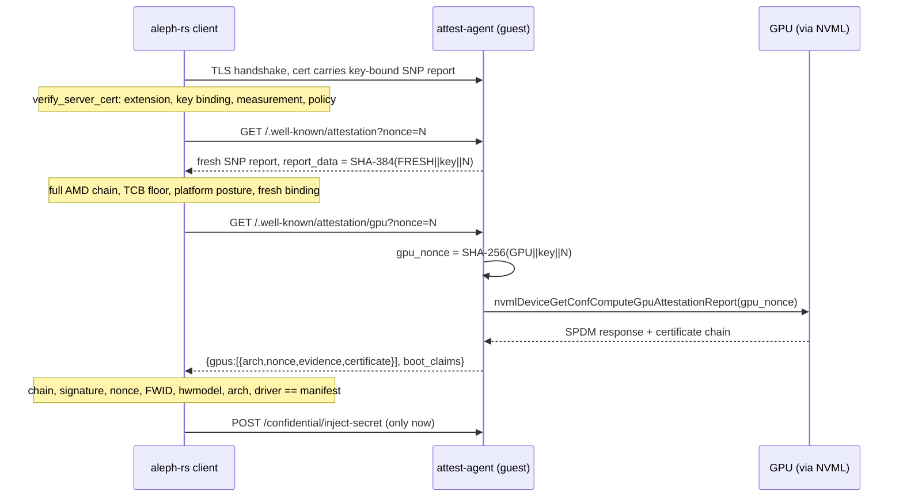

# NVIDIA confidential computing on SEV-SNP: design

**Date:** 2026-09-04
**Status:** Approved design, ready for implementation planning.
**Branch:** `od/nvidia-cc-design` off `origin/dev-2.1`.

**Driver:** product. Confidential GPU inference is the workload V-PROGRAMs
exist for, and the fleet is about to gain an NVIDIA RTX PRO 6000 Blackwell
Server Edition. This design carries a V-PROGRAM from "I need one confidential
GPU" in the message to a client that has verified both the AMD SEV-SNP guest
and the GPU inside it before sending a byte of secret. The host is the
adversary throughout, exactly as for SEV-SNP today.

**Related:**

- [`../../architecture/confidential.md`](../../architecture/confidential.md),
  the SEV-SNP attestation stack this design extends.
- [`../../plans/2026-07-08-confidential-vm-protocol-design.md`](../../plans/2026-07-08-confidential-vm-protocol-design.md),
  section 13 lists NVIDIA-CC as an enum slot only; this design fills it.
- [`2026-08-20-intel-tdx-design.md`](2026-08-20-intel-tdx-design.md)
  (branch `od/tdx-design`), whose "own the parsing, third-party as oracle"
  discipline and `tee_min_tcb` generalization this design reuses.
- [`../../plans/2026-08-12-snp-tcb-floor-design.md`](../../plans/2026-08-12-snp-tcb-floor-design.md)
  (G1), the client-side floor architecture.

---

## 1. Goal and scope

Deliver, across four repositories, the full chain for a single-GPU
confidential V-PROGRAM:

1. **Schema.** A V-PROGRAM can declare that it needs one confidential NVIDIA
   GPU; the runtime manifest declares the GPU facts a client pins.
2. **Host.** A CRN inventories which cards are in NVIDIA CC mode, advertises
   them as TEE capability, and passes exactly one such card through into a
   measured SEV-SNP guest.
3. **Guest.** The measured runtime image carries the NVIDIA open kernel
   modules, the driver userland, and NVIDIA's local verifier. At boot the
   guest verifies its own GPU against NVIDIA's reference manifests, sets the
   GPU ready state, and fails closed on any error. At request time the
   attest-agent serves fresh GPU evidence bound to the client's nonce and to
   the attested TLS key.
4. **Client.** The aleph-rs SDK verifies the GPU evidence's certificate chain,
   signature, nonce binding, firmware identity and driver version in pure
   Rust, and `aleph vprogram call` refuses to proceed when a declared GPU
   fails any check.

Out of scope for this design, listed with their reasons in section 9:
multi-GPU passthrough, SNP confidential instances with GPUs, the compose
runtime flavor, full client-side RIM verification, and TDX hosts.

### 1.1 What was verified before designing

- Only the RTX PRO 6000 Blackwell **Server Edition** has CC mode today.
  Workstation and Max-Q editions are announced for later. The card in the
  fleet is the Server Edition.
- On this SKU only single-GPU passthrough ("SPT CC") is validated by NVIDIA
  and its partners; multi-GPU CC needs NVLink, which this SKU lacks.
- NVIDIA's June 2026 self-hosted CVM reference architecture validates our
  exact host shape: KVM/QEMU 9.2 with OVMF, SEV-SNP on EPYC Genoa, GPU set to
  CC mode with `gpu-admin-tools`, plain `-device vfio-pci` passthrough, and
  **no NVIDIA driver on the host**.
- Driver R580 introduced CC for this SKU; R595 is the current GA. nixpkgs
  `nixos-26.05` (the guest image's pin) ships 595.71.05 with the open kernel
  modules and a `firmware` output holding the GSP blobs.
- NVIDIA's local verifier is now a C library, `libnvat` (attestation-sdk
  1.2.2, Apache-2.0), with a CLI (`nvattest`) and Rust bindings. Its Python
  predecessor (`nvtrust` local verifier 1.x) reaches end of support on
  2026-09-15. Evidence can be collected in one process and verified in
  another from a JSON string; that is what makes the guest/client split
  below possible.
- The public claims schema, the evidence JSON shape, two captured Hopper
  evidence vectors with their certificate chains, and the two NVIDIA root
  certificates (device identity, `10:2B:F6:59...`; CoRIM signing,
  `12:97:7B:51...`) are all in the SDK repository, so the client-side
  verifier can be built and tested with no GPU anywhere.

---

## 2. Background: what fits, what does not

| Layer | SEV-SNP today | NVIDIA CC | Verdict |
|---|---|---|---|
| `TeeType` wire enum | `sev-snp` | `nvidia-cc` already defined on both sides, unused | fill in |
| `AttestationReport{tee_type,data}` | one signed blob | GPU evidence is a signed SPDM response plus a cert chain plus a nonce, per GPU | new type, same discipline |
| `report_data` schemes | domain-separated SHA-384 | GPU nonce is 32 bytes; derive it, never reuse the client nonce raw | new scheme, same file |
| attest-agent routes | `/.well-known/attestation` | sibling route for GPU evidence | additive |
| SNP argv | `q35`, no passthrough | `q35` already; add root port, `vfio-pci`, MMIO window | extend `build_snp_argv` |
| GPU inventory | vendor, class, vfio binding | add CC mode read from BAR0 | extend `lspci.rs` |
| guest kernel | whitelist, no PCI drivers beyond virtio | NVIDIA open modules need a handful more options | fragment grows, measurement moves |
| guest rootfs | static busybox | driver userland, firmware, verifier, CA bundle | new image flavor |
| verifier | aleph-rs, pure Rust | binding checks in pure Rust; RIM comparison delegated to the measured guest | new module |
| floor policy | `snp_min_tcb` | driver floor and accepted architectures | `tee_min_tcb.nvidia_cc` |

Three fail-closed gates already refuse GPUs on SNP paths, each covered by a
test: the agent before any staging I/O (`run.py`), the daemon at spec build
(`lifecycle.rs`, `snp_config_slice`), and the controller by construction
(`build_snp_argv` emits no passthrough). They stay, narrowed to "no GPU
unless it is in CC mode and the spec is a GPU V-PROGRAM".

---

## 3. Decisions

1. **GPU evidence is verified twice, by two parties with different jobs.**
   The measured guest runs NVIDIA's full local verifier at boot (RIM
   comparison, OCSP, ready state) and powers off on failure. The client
   independently checks what pure cryptography can check without NVIDIA's
   XML tooling: chain to a pinned NVIDIA root, signature, nonce binding,
   firmware identity, architecture, driver version. The client trusts the
   guest's RIM verdict because the verifier binary and its pinned roots are
   inside the SNP launch measurement and init fails closed. Full
   client-side RIM verification is a documented later hardening (section 9).
2. **The CRN stays out of the trust path.** Evidence flows guest to client
   over the existing RA-TLS channel. Nothing the CRN relays is part of the
   proof.
3. **One client nonce drives both proofs.** The SNP fresh report binds the
   client nonce to the served TLS key as today. The GPU nonce is derived:
   `SHA-256("aleph-gpu-nonce-v1\0" || served_public_key || client_nonce)`.
   The client recomputes it. The raw client nonce never reaches the GPU.
4. **GPU facts a client pins live in the runtime manifest, not the
   message.** Driver version and architecture are properties of the
   measured runtime, pinned through `runtime.ref`. A driver bump is a new
   runtime bundle, never a republish of every V-PROGRAM. The message only
   declares the requirement.
5. **CC mode is probed, not declared.** The daemon reads the same BAR0
   register `gpu-admin-tools` reads, through the card's sysfs resource
   file, for cards not attached to any VM. A node advertises only what it
   can launch.
6. **Single GPU per V-PROGRAM in v1**, enforced at schema level
   (`max_length=1`). It is the only mode NVIDIA validates on this SKU, and
   it keeps the ready-state and evidence model per-VM rather than per-fabric.
7. **The driver userland is a runtime contract.** The measured platform
   rootfs carries the driver's user-space libraries and bind-mounts them
   into the workload chroot at a fixed path, the way the NVIDIA container
   toolkit does. Workload images link against those and must not bundle
   their own `libcuda`; a mismatched pair fails at CUDA init, inside the
   guest, visibly.
8. **A separate GPU image flavor.** `gpuImage` sits next to `image` and
   `composeImage` with its own golden measurement. A runtime without a GPU
   stays byte-identical to today, so existing published bundles keep their
   measurements.
9. **We own the SPDM and certificate parsing on the client.** NVIDIA's SDK
   and its captured vectors are the differential oracle; `libnvat` never
   links into aleph-rs. Same rationale as the TDX decision: the verifier's
   trust path should be small, auditable Rust, and the C++ SDK drags in
   corrosion, regorus, jwt-cpp, xmlsec1 and a bindgen toolchain that every
   CLI user would otherwise pay for.
10. **Nothing fails open.** A GPU V-PROGRAM whose GPU cannot be verified at
    boot powers off. A client asked to call a GPU V-PROGRAM whose evidence
    fails any check makes no request. A CRN whose probe cannot read CC
    mode advertises no confidential GPU.

---

## 4. Trust model and evidence flow

### 4.1 Parties and what each proves

- **AMD** signs the SNP report: this guest, with this launch measurement
  and policy, on a platform at this TCB, holds this TLS key.
- **NVIDIA** signs, through the GPU's device identity key, the SPDM
  measurement response: this GPU (hardware model, unique id) running this
  firmware (FWID) at this driver and VBIOS version answered this nonce with
  these measurement blocks. The chain runs leaf, NVIDIA Device Identity
  intermediate, NVIDIA Device Identity CA root.
- **The measured guest** proves, through the SNP measurement, that its boot
  ran NVIDIA's verifier with pinned roots and would have powered off on a
  RIM mismatch, a revoked certificate, or a nonce mismatch.
- **The client** ties the three together: the served TLS key appears in the
  SNP report, the GPU nonce is derived from that key and the client's
  nonce, and both responses arrive over the channel that key secures.

### 4.2 Request-time sequence



The two attestation requests are ordered: the GPU request is only made after
the fresh SNP report verified, so a guest that fails SNP verification never
learns the client wants a GPU proof. Both ride `attested_request`, so the
pins apply to every exchange.

### 4.3 Nonce derivation

`report_data.rs` gains a third scheme next to `key_bound_report_data` and
`fresh_report_data`:

```rust
pub const DOMAIN_GPU_NONCE: &[u8] = b"aleph-gpu-nonce-v1\0";

/// 32-byte SPDM nonce for GPU evidence, bound to the served TLS key and the
/// client's nonce. Domain-separated from the SNP schemes so no GPU nonce can
/// be mistaken for, or replayed as, an SNP report_data.
pub fn gpu_nonce(served_public_key: &[u8], client_nonce: &[u8]) -> [u8; 32]
```

SHA-256 rather than SHA-384 because the SPDM nonce field is 32 bytes and
truncating a SHA-384 would invite a "which 32 bytes" mismatch between guest
and client. Mirrored verbatim in the aleph-rs SDK (`ratls.rs` already
mirrors the two SNP schemes).

### 4.4 The GPU attestation response

`GET /.well-known/attestation/gpu?nonce=<hex>` returns:

```json
{
  "tee_type": "nvidia-cc",
  "client_nonce": "<hex, echoed>",
  "gpus": [
    {
      "arch": "BLACKWELL",
      "nonce": "<hex, 32 bytes, the derived gpu_nonce>",
      "evidence": "<base64 SPDM GET_MEASUREMENTS response>",
      "certificate": "<base64 PEM chain, leaf first>"
    }
  ],
  "boot_claims": [ { "...": "the per-GPU claims JSON libnvat produced at boot" } ]
}
```

`gpus` entries are byte-for-byte the evidence JSON `nvattest
collect-evidence --format json` emits, so the client's parser and NVIDIA's
verifier read the same document. `boot_claims` is informational for the
client (driver and VBIOS versions, RIM match results, timestamps); nothing in
it is trusted beyond what the measured image implies, and the client never
skips a cryptographic check because a claim says it passed.

Errors: 400 on an over-long or non-hex nonce (same bound as the SNP route),
503 with `{"error": "gpu not attested"}` when boot-time verification did not
complete (unreachable in practice, since init powers off), 500 with a bare
message when NVML fails; detail stays in the guest log.

The existing `AttestationReport` and the `/.well-known/attestation` response
are untouched. A separate route keeps older clients parsing exactly what they
parse today.

### 4.5 Client-side checks (aleph-rs)

New module `crates/aleph-sdk/src/attest/nvidia/` with `spdm.rs`,
`chain.rs`, `verify.rs`, `mod.rs`. Every check is fail-closed and
constant-time where a secret-independent comparison is not obviously fine:

1. **Parse** the SPDM 1.1 GET_MEASUREMENTS response: version, response code
   `0x60`, param1/param2, block count, 3-byte record length, measurement
   record, 32-byte nonce, 2-byte opaque length, opaque data, signature.
   Signature is 96 bytes (ECDSA P-384, raw `r || s`) for both Hopper and
   Blackwell. Lengths are checked against the buffer before every slice.
   Opaque data is a TLV list (2-byte type, 2-byte length); types used:
   `DRIVER_VERSION` (3), `VBIOS_VERSION` (6), `FWID` (20), `PROJECT` (17),
   `MSRSCNT` (12). Unknown types are skipped, not rejected.
2. **Rebuild the request**: SPDM version `0x11`, code `0xE0`, param1
   `0x01` (signed), param2 `0xFF` (all measurements), the 32-byte nonce,
   slot id `0x00`. The signed message is `request || response` with the
   signature bytes removed from the end.
3. **Chain**: parse the PEM chain and verify it up to the pinned NVIDIA
   Device Identity CA root (the same "pinned ARK" stance as SNP). A root
   certificate the guest supplies in the chain is discarded, never trusted.
   Each signature is verified, validity windows are checked, and the leaf
   must carry the TCG DICE FWID extension used in step 6.
4. **Signature**: ECDSA P-384 with SHA-384 over the signed message, using
   the leaf's public key, via `ring`.
5. **Nonce**: response nonce equals `gpu_nonce(served_key, client_nonce)`.
6. **FWID**: the opaque `FWID` value equals the FWID carried in the leaf's
   TCG DICE extension, OID `2.23.133.5.4.1.1` for Blackwell
   (`2.23.133.5.4.1` for Hopper). Binds the signing key to the firmware
   that was measured.
7. **Identity**: `arch` from the evidence matches the architecture in the
   runtime manifest, and the leaf's hardware model matches the manifest's
   accepted model list.
8. **Driver**: opaque `DRIVER_VERSION` equals the manifest's
   `gpu.driver_version`. This is what makes "the measured image's driver is
   the one talking to the GPU" a client-checked fact rather than an
   inference.
9. **Floor**: driver version at or above `tee_min_tcb.nvidia_cc.min_driver`
   and `arch` in `accepted_archs` (section 5.4).

OCSP for the GPU device chain and RIM comparison are not performed by the
client in v1. They are the measured guest's boot-time job (section 6.4), and
the manifest pins the runtime that did it. Section 9 records the path to
closing this.

`VerificationResult` gains `gpu: Option<Vec<GpuVerification>>` carrying
parsed identity facts (hwmodel, ueid, driver, vbios, fwid hex) for display
and JSON output; it is derived from verified bytes, never from
`boot_claims`.

---

## 5. Schema changes

### 5.1 aleph-message: the V-PROGRAM declares its GPU

```python
class ConfidentialGpu(HashableModel):
    """One GPU that must be attached in confidential-computing mode."""
    vendor: Literal["nvidia"]
    device_id: str = Field(pattern=r"^[0-9a-f]{4}:[0-9a-f]{4}$")
    model_config = ConfigDict(extra="forbid")


class VerifiableProgramContent(BaseExecutableContent):
    ...
    gpus: Optional[List[ConfidentialGpu]] = Field(default=None, max_length=1)
```

The field is optional rather than defaulting to an empty list: a
V-PROGRAM message's `check_content` compares the model dump to the signed
`item_content`, so a defaulted list would make every message signed before
this field exists unparseable. Absent and empty both mean "no GPU";
consumers read `content.gpus or []`. `requires_gpu` is overridden on the
V-PROGRAM content to read this field, since the inherited
`requirements.gpu` channel is refused there.

`device_id` is the same `vendor:device` string the instance
`GpuProperties.device_id` and the settings aggregate `compatible_gpus` use,
so one identifier names a card kind everywhere. `max_length=1` is decision
6. `TeeVerification.backend` stays `Literal["sev_snp"]`: the GPU is not a
launch platform and pins no launch register, so it does not belong in
`LaunchMeasurement`. This is a minor schema release with no change to the
SNP wire shape; a message without `gpus` serializes exactly as today.

The Rust `aleph-types` mirror gains the same struct with
`deny_unknown_fields` and the same bound.

### 5.2 Runtime manifest: the GPU facts a client pins

`src/aleph/vm/vprogram/manifest.py`, `RuntimeManifest` gains an optional
block:

```python
class GpuRuntimeSpec(StrictModel):
    vendor: Literal["nvidia"]
    arch: Literal["blackwell", "hopper"]
    driver_version: str = Field(pattern=r"^\d+\.\d+(\.\d+)?$")
    accepted_models: list[str] = Field(min_length=1)
    library_path: str = Field(pattern=r"^/[a-z0-9/_-]+$")

gpu: GpuRuntimeSpec | None = None
```

`accepted_models` lists the hardware-model strings NVIDIA's device
certificates carry for the SKUs this runtime was validated on.
`library_path` is where the driver userland is bind-mounted into the
workload chroot (decision 7), published so workload builders can link
against it. The bundle builder (`bundle.py`) fills the block from the Nix
derivation's outputs, the way it fills `boot.platform_roothash` today.

A V-PROGRAM with `gpus` non-empty whose manifest has no `gpu` block fails
spec build on the CRN (`VmSetupError`) and fails `vprogram call` on the
client: the runtime cannot drive a GPU and must not pretend to.

### 5.3 CRN capability advertisement

`src/aleph/vm/agent/resources.py`, `TeeProperties` gains a sibling of
`sev_snp`:

```python
class NvidiaCcDevice(BaseModel):
    device_id: str
    model: str | None

class NvidiaCcProperties(BaseModel):
    devices: list[NvidiaCcDevice]

class TeeProperties(BaseModel):
    sev_snp: SevSnpProperties | None = None
    nvidia_cc: NvidiaCcProperties | None = None
```

`devices` lists only cards whose probe reported `on`, and `nvidia_cc` is
present only when that list is non-empty **and** `sev_snp` is present: a
CC-mode GPU on a host that cannot launch SNP is not a capability.
`MachineUsage.gpu` devices gain a `cc_mode` field (`on`, `devtools`, `off`,
or absent) so an operator sees every card's mode, including the ones the
capability view omits. The scheduler (aleph-vm-scheduler, V-PROGRAM
placement) matches `gpus[].device_id` against
`properties.tee.nvidia_cc.devices` and picks CRNs with a free one.

### 5.4 Settings aggregate floor

`snp_min_tcb` generalizes to `tee_min_tcb` as the TDX design already
specifies (decision 3 there), and gains:

```json
"tee_min_tcb": {
  "sev_snp": { "...": "unchanged" },
  "nvidia_cc": {
    "min_driver": "595.71.05",
    "accepted_archs": ["blackwell", "hopper"]
  }
}
```

Enforcement is client-side with a compiled-in baseline the aggregate can
only raise; an unreachable aggregate falls back to the baseline with a
warning. `--min-gpu-driver` and `--accept-outdated-gpu-driver` mirror the
SNP flags on `vprogram call`.

---

## 6. Guest image (`nix/`)

### 6.1 Kernel

The whitelist fragment gains what the NVIDIA open modules and a passthrough
PCIe device need. The exact set is settled by building the modules against
the kernel in CI (section 8): the fragment check fails the build on any
option the modules need and the fragment lacks, so the list is discovered
by construction rather than guessed. The expected additions are
`MMU_NOTIFIER`, `PCI_MMCONFIG` and `DMA_SHARED_BUFFER`. `SWIOTLB` is selected by
`X86_64` and forced by `AMD_MEM_ENCRYPT`, so bounce buffering is already
there; only its size is a concern (6.2). No DRM, no VT, no `nvidia-drm` or
`nvidia-modeset`: a compute-only guest has no display.

The hardening set stays as is. Every added option moves the launch
measurement; the golden measurements for the new `gpuImage` flavor are
seeded in the same PR, and the existing `image` and `composeImage` flavors
keep their kernel by building the GPU kernel as a separate derivation
(`kernel-gpu.nix` reusing `kernel.nix` with an extra fragment), so their
golden values do not move.

### 6.2 Measured cmdline

The GPU runtime's cmdline template is
`console=ttyS0 root=/dev/mapper/verity-root ro roothash={platform_roothash} workload_roothash={workload_roothash} swiotlb=262144 verified_volumes={verified_volumes}`.
`swiotlb=262144` (512 MiB of bounce buffer) is NVIDIA's recommendation for
CC guests; it is a fixed part of the runtime, not a placeholder, so the
manifest's closed placeholder set is unchanged. The daemon derives the
measured cmdline from sidecars next to the rootfs rather than from the
template, so the agent copies this token into a fourth sidecar,
`{rootfs}.cmdline_extra`, which the daemon validates against a closed
allowlist (`swiotlb=<digits>` only) and splices at the template's position,
between `workload_roothash` and `verified_volumes`. The manifest validator
rejects any other fixed token, so the template cannot become a kernel
parameter smuggling channel. The bounce buffer is guest
memory the workload cannot use, so the GPU runtime documents a 2 GiB
minimum for `resources.memory` and the agent rejects a smaller V-PROGRAM at
spec build (`VmSetupError`) rather than booting a guest that cannot
allocate its driver buffers.

### 6.3 Driver and userland

`nix/nvidia.nix` builds, from the nixpkgs pin:

- `nvidia.ko` and `nvidia-uvm.ko` from the open modules against the GPU
  kernel (`kernel-modules.nix` with `open = true`; `NV_EXCLUDE_KERNEL_MODULES`
  drops drm, modeset and peermem). They go in the GPU initrd next to the
  dm-* modules, xz-decompressed like them, loaded by init after the verity
  mount.
- The GSP firmware from the driver's `firmware` output, into the rootfs at
  `/lib/firmware/nvidia/<version>/`, not the initrd: it is tens of megabytes
  and only the rootfs roothash should carry it.
- The driver's user-space libraries needed for compute and attestation:
  `libcuda`, `libnvidia-ml`, `libnvidia-ptxjitcompiler`, `libnvidia-nvvm`,
  `libnvidia-gpucomp`, `libnvidia-pkcs11-openssl3` and their dependencies,
  into the rootfs at the manifest's `library_path` (`/opt/nvidia/lib`), plus
  `nvidia-smi` for the operator log.
- `libnvat` and `nvattest` from a pinned attestation-sdk source, built with
  `USE_SYSTEM_DEPS=ON` against nixpkgs OpenSSL, curl, libxml2 and xmlsec1,
  and the `FetchContent` inputs (corrosion, regorus and its cargo vendor,
  jwt-cpp, nlohmann json, fmt, spdlog) supplied through
  `FETCHCONTENT_SOURCE_DIR_<NAME>` from fixed-output fetches. A CA bundle
  for NVIDIA's RIM and OCSP endpoints goes in the rootfs.
- `/dev/nvidia*` nodes are created by init from the modules' major numbers
  (no udev in the guest); `/dev/nvidia-uvm` and `/dev/nvidiactl` included.

The rootfs stays reproducible under the same determinism levers
(`SOURCE_DATE_EPOCH=0`, fixed UUID and hash seed, no journal); the driver
archive is a fixed-output fetch and nixpkgs already patches the ELF
interpreters deterministically.

### 6.4 Init: boot-time GPU verification

`nix/init-gpu.sh`, sourced by `init.sh` after the verity mounts and before
`prepare_chroot`, runs only when a GPU is present on the PCI bus (the
platform image without one is unaffected). Steps, each failing to
`poweroff -f`:

1. `insmod nvidia.ko` with `NVreg_EnableGpuFirmware=1` (GSP is mandatory
   for CC), then `nvidia-uvm.ko`; create device nodes.
2. `nvattest attest --device gpu --verifier local --nonce <boot nonce>
   --rim-url https://rim.attestation.nvidia.com --ocsp-url
   https://ocsp.ndis.nvidia.com --format json`, with the boot nonce drawn
   from `/dev/urandom`. This performs, in the guest: evidence collection,
   attestation report signature and chain verification with OCSP, driver
   RIM and VBIOS RIM fetch, signature and schema validation, measurement
   comparison, and produces the claims and detached EAT.
3. Check `result_code == 0` and every per-GPU `measres == "Success"`.
4. Set the GPU ready state explicitly with `nvidia-smi conf-compute -srs 1`
   from the raw driver userland, so the gate does not depend on
   `nvattest`'s own root-mode side effects, and read it back with
   `conf-compute -grs` before continuing.
5. Write the claims JSON to `/run/aleph/gpu-boot-claims.json` (tmpfs,
   mode 0600) for the attest-agent.
6. Bind-mount `/opt/nvidia/lib` and the `/dev/nvidia*` nodes into the
   workload chroot (`prepare_chroot` gains this when the mount exists).

Then the attest-agent starts with `--gpu-claims /run/aleph/gpu-boot-claims.json`,
which enables the GPU route.

RIM and OCSP fetches leave the guest through the host's network. That is
acceptable: RIMs and OCSP responses are NVIDIA-signed and the verifier
checks the signatures against its pinned roots, so a host can delay or deny
boot (it always could) but cannot forge a pass. A host that blocks the
fetches produces a VM that powers off, which the CRN reports as a failed
launch. There is no offline RIM cache in v1; section 9 lists it.

### 6.5 Attest-agent

`rust/crates/aleph-attest-agent` gains `gpu.rs`. The agent is a static
musl binary inside a content-only measured initrd, so it cannot load
NVIDIA's glibc NVML library itself. Instead, when init passes
`--gpu-claims` and `--gpu-collector`, the route handler derives the nonce
(4.3) and runs NVIDIA's own `nvattest collect-evidence --device gpu
--format json --nonce <hex>` as a child process chrooted into the rootfs,
parses the `evidences` array it prints (the exact 4.4 per-GPU shape),
refuses any entry whose nonce is not the one asked for, and returns the
4.4 document. A mutex serializes GPU evidence requests; concurrent callers
queue rather than overlap SPDM sessions. The non-GPU image starts the agent
without those flags and the route answers 404.

The agent does not verify anything itself. It is a relay for signed
evidence; verification at request time is the client's (4.5), verification
of reference values was init's (6.4).

### 6.6 Flavors and measurements

`flake.nix` gains `gpuKernel`, `gpuInitrd`, `gpuRootfs`, `gpuVerity`,
`gpuImage`, `gpuMeasurement`, and `gpuMeasurementFor`. The bundle builder
emits a runtime manifest with the `gpu` block (5.2). `golden-measurements.json`
gains the `gpu` entry; the CI golden check covers it. `boot-smoke.sh` gets a
`--gpu` mode that boots `gpuImage` under plain QEMU with no device and
expects init to skip the GPU step, which is the only smoke a GPU-less CI
runner can do.

---

## 7. Host side (aleph-vm)

### 7.1 Inventory and CC mode probe

`rust/crates/supervisor-daemon/src/lspci.rs`, `GpuDevice` gains
`cc_mode: Option<CcMode>` (`On`, `Devtools`, `Off`; `None` when the card is
not NVIDIA or the probe could not run). The probe (`gpu_cc_mode.rs`):

1. Map `/sys/bus/pci/devices/<bdf>/resource0` read-only.
2. Determine the architecture from the PCI device id using the per-chip
   ranges `gpu-admin-tools` publishes in `gpu/devid_chips.py` (the RTX PRO
   6000 Blackwell is a GB202, `0x2B80`-`0x2BFF`), vendored as a table with
   a test that pins the current file's contents. A device id outside every
   known range yields `None`.
3. Read the 32-bit register at `0x590` (Blackwell) or `0x1182CC` (Hopper);
   bits `[1:0]` are `0b01` on, `0b11` devtools, `0b00` off.
4. Unmap.

The probe runs only for cards that no VM in the world view owns, at
inventory refresh, and its result is cached per card until the card's
attachment state changes. Reading a register of a card a guest is driving
is never done. A probe error is logged and yields `None`, which advertises
nothing.

The proto `GpuDevice` gains `string cc_mode = 5` (empty when unknown).
`available_gpus_json` carries it through to the agent.

### 7.2 Launch

`build_snp_argv` gains, when `config.gpus` is non-empty:

```
-device pcie-root-port,id=rp0,bus=pcie.0,chassis=1
-device vfio-pci,host={bdf},bus=rp0,rombar=0
-fw_cfg name=opt/ovmf/X-PciMmio64Mb,string={mmio_mb}
```

No `x-vga`; a compute GPU in an SNP guest has no display. `mmio_mb` is
computed from the card's BAR sizes read from `/sys/bus/pci/devices/<bdf>/resource`
(the sum of 64-bit prefetchable BARs, rounded up to the next power of two,
doubled), never a hardcoded constant: this SKU's BAR1 is 96 GiB-class, and
the next SKU's will differ. The `-cpu` line stays the measured model;
`host,host-phys-bits-limit` from the plain GPU path is not used, because
the CPU model is a measurement input. `fw_cfg` values are not measured, so
the MMIO window does not move the launch digest, which is what lets the
window follow the card.

`snp_config_slice` accepts GPUs when every card in the spec reports
`cc_mode == On` and the spec's runtime manifest declares a `gpu` block; any
other GPU on an SNP spec stays `InvalidBackend`, with the message naming
which condition failed. The controller keeps its conformance oracle test:
with no GPU, the SNP argv is byte-identical to today.

Hugepage and NUMA placement are unchanged; a GPU V-PROGRAM is placed like
any other, and `vfio-pci` pins guest memory the way it does for plain GPU
VMs, so the balloon is already absent on the SNP path.

### 7.3 Agent

`vprogram_launch.py`: when `content.gpus` is non-empty, resolve each
`device_id` against `available_gpus` filtered to `cc_mode == "on"`, take a
`GpuHold` scoped to the owner as the instance path does, require the
manifest's `gpu` block, and put the resolved `GpuSpec` on the
`CreateVmSpec`. Resolution failure is `InsufficientResourcesError` with
`required={"confidential_gpu_device_id": ...}`, distinct from the plain
GPU message so the scheduler and the log tell the two apart.

`run.py`'s SNP-instance gate is unchanged (instances are out of scope). The
V-PROGRAM stop-guard is unchanged: a V-PROGRAM absent from the allocation
is stopped and its GPU hold released.

Capacity accounting: a held CC-mode card is removed from
`nvidia_cc.devices` in `/about/capability` and from
`available_devices` in `/about/usage/system` for the VM's lifetime.

### 7.4 Operator runbook

`docs/operators/nvidia-cc.md` (new): BIOS requirements (SEV-SNP, IOMMU,
above-4G decoding, resizable BAR), binding the card to `vfio-pci` at boot
(existing GPU docs), enabling CC mode once with
`nvidia_gpu_tools.py --devices <bdf> --set-cc-mode=on --reset-after-cc-mode-switch`,
confirming with `--query-cc-mode`, verifying the CRN advertises it in
`/about/capability`, and the failure signatures: a card that reports
`devtools` is refused, a card the host driver grabbed is not vfio-bound and
never appears, a VM that powers off within a minute of boot with
`gpu attestation failed` in its console log means RIM or OCSP were
unreachable or mismatched.

---

## 8. Testing

**Tier 1, no hardware, every PR:**

- `supervisor-controller`: argv oracle tests for the SNP GPU fragment
  (root port, vfio-pci, fw_cfg) across BAR sizes, and the byte-identity
  test for the no-GPU SNP argv.
- `supervisor-daemon`: CC-mode probe against captured `resource0` and
  `resource` fixtures for a Blackwell card in each mode and a Hopper card;
  `snp_config_slice` acceptance and each rejection reason; inventory JSON
  parity with the agent.
- Agent: V-PROGRAM GPU resolution, hold and release, manifest `gpu` block
  required, capability advertisement with and without SNP.
- `aleph-tee` and attest-agent: `gpu_nonce` vectors shared with aleph-rs
  as a cross-repo fixture (the same trick as the four-repo V-PROGRAM
  fixture); route shape tests with a fake NVML.
- aleph-rs: the SPDM parser, chain verification, signature and nonce
  checks against NVIDIA's captured `hopper_evidence.json` and
  `hopper_evidence_cert_hold.json` vectors, plus mutated copies (flipped
  signature byte, wrong nonce, truncated record, swapped FWID, expired
  chain) that must each fail with the named error. `nvattest attest
  --gpu-evidence-source=file` on the same vectors is the differential
  oracle, run in CI from the SDK's release tarball.
- Nix: `gpuImage`, `gpuKernel` and `libnvat` build in the golden
  measurement workflow; the fragment verification step fails the build if
  the NVIDIA modules need an option the fragment lacks.

**Tier 2, SNP host with the Server Edition card, on demand:**

- Boot `gpuImage` with passthrough; init reaches ready state; `nvidia-smi
  conf-compute -q` in the guest reports CC on and ready.
- `aleph vprogram call` end to end, including a run with the aggregate
  floor above the driver version (must refuse) and a run with a mutated
  evidence proxy (must refuse).
- The no-GPU platform image on the same host is measured and launched
  unchanged.

Tier 2 is specified in this design and executed when the host is ready; no
implementation increment blocks on it.

---

## 9. Non-goals and later hardening

- **Multi-GPU per VM.** Needs NVLink-encrypted MPT CC, which this SKU lacks;
  the schema bound lifts when a validated multi-GPU SKU joins the fleet.
- **SNP confidential instances with a GPU.** The owner's rootfs would bring
  its own driver and verifier; passthrough and the capability model carry
  over, the boot-time verification contract does not. Second product.
- **Compose runtime flavor.** Needs a CDI spec for podman and per-container
  device injection. Follows once the platform flavor has run on hardware.
- **Full client-side RIM verification.** Requires XML-DSig over swidtag
  RIMs in Rust or linking `libnvat` into the SDK. Revisit when either a
  maintained Rust XML-DSig implementation exists or NVIDIA publishes CoRIM
  (CBOR) RIMs for this generation, which are tractable in pure Rust.
- **Client-side OCSP for the device chain.** Straightforward once the chain
  code exists; deferred only to keep v1 small.
- **Offline RIM cache in the guest.** A `RimStore::create_filesystem` seeded
  in the measured rootfs would let an air-gapped CRN boot; the cache
  content would then be a measurement input, which is a feature.
- **TDX hosts.** The GPU side is host-agnostic; the TDX design owns the
  host side.
- **Devtools CC mode.** Refused everywhere; it lifts the profiling blocks
  and is not a confidential configuration.

---

## 10. Cross-repo sequencing

1. **aleph-message**: `ConfidentialGpu`, `VerifiableProgramContent.gpus`
   (minor release; nothing else changes).
2. **aleph-vm**, in stacked PRs: (a) `gpu_nonce` scheme and attest-agent
   GPU route behind `--gpu-claims`; (b) daemon CC-mode probe and proto
   field; (c) controller SNP argv fragment and `snp_config_slice` gate;
   (d) Nix GPU flavor, `libnvat`, init-gpu, golden seed; (e) manifest
   `gpu` block, bundle builder, agent resolution and advertisement,
   operator doc.
3. **aleph-rs**: `aleph-types` mirror, `attest::nvidia`, `tee_min_tcb`
   generalization (shared with the TDX work), `vprogram call` wiring.
4. **aleph-vm-scheduler**: placement on `tee.nvidia_cc.devices`.

Steps 2(a) to 2(d) and 3 are hardware-free and can proceed in parallel
with the host build-out. 2(e) and 4 need the message release. Tier 2 runs
once, on the finished stack.

---

## 11. Sources

- NVIDIA, "Deploying Proprietary Models Securely with NVIDIA Confidential
  Computing on Self-Hosted Virtual Machines", 2026-06-04: software
  component table, SEV-SNP QEMU launch flags, RTX PRO 6000 Blackwell Server
  Edition validation profile.
- NVIDIA attestation-sdk (1.2.2): `nv-attestation-sdk-cpp/src/gpu/evidence.cpp`
  (architecture table, FWID OIDs, signature length), `src/spdm/*`,
  `src/internal/certs.h` (root certificates), `common-test-data/`
  (evidence vectors), `nv-attestation-cli` (`collect-evidence`, `attest`
  with file evidence), claims JSON schema.
- NVIDIA gpu-admin-tools: `nvidia_gpu_tools.py` (`query_cc_mode_hopper`,
  `query_cc_mode_blackwell`, device-id ranges in `gpu/devid_chips.py`).
- NVIDIA nvtrust local verifier: SPDM 1.1 request and response layouts
  (`attestation/spdm_msrt_req_msg.py`, `spdm_msrt_resp_msg.py`), signed
  message construction (`AttestationReport.concatenate`), RIM and OCSP
  service URLs (`config.py`).
- nixpkgs `nixos-26.05` at `0dd31db7`: `nvidiaPackages.production`
  595.71.05 with `open` and `firmware` outputs, `kernel-modules.nix`.
- Super Protocol, "GPU + CPU Requirements for TEE Mode" (updated
  2026-05-22): per-SKU and per-driver CC mode availability for RTX PRO
  6000 Blackwell editions.
- aleph-vm `dev-2.1` at `9c3272ef`: `qemu.rs` (`gpu_args`,
  `build_snp_argv`, `snp_tee_fragment`), `lifecycle.rs`
  (`snp_config_slice`), `lspci.rs`, `resources.py`, `vprogram_launch.py`,
  `nix/kernel-config.fragment`, `nix/init.sh`, `nix/rootfs.nix`.
